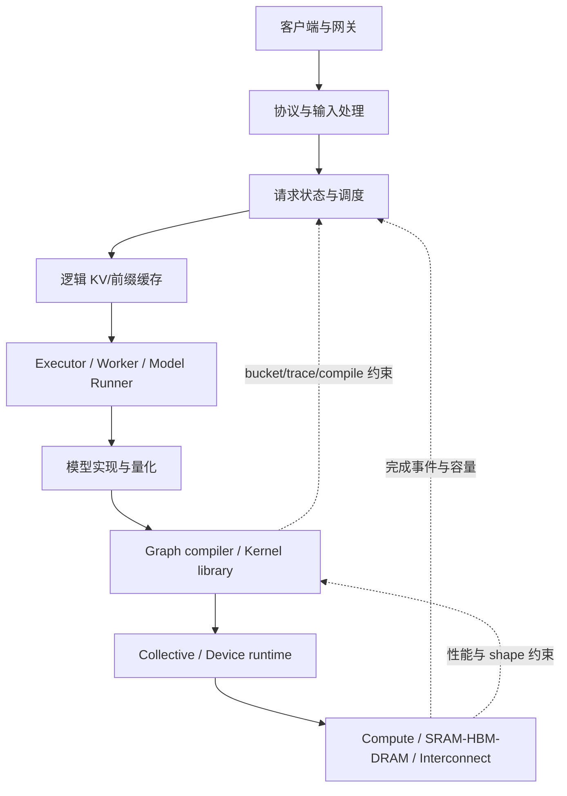

# AI 推理基础设施全栈架构

## 核心结论

LLM serving 不是“模型跑在芯片上”这么简单。线上系统需要把不规则、持续到达的请求，转换成硬件可高效执行的规则张量程序，同时维持请求隔离、KV Cache 生命周期、流式输出和故障恢复。真正的架构难点集中在三个跨层闭环：

1. 请求形状与调度策略如何匹配编译和执行形状；
2. 逻辑 token/KV 生命周期如何映射到物理内存；
3. 服务完成语义如何映射到异步设备、graph 或分布式 collective 的完成语义。

## 分层模型

### 服务与协议层

职责包括 OpenAI-compatible API、鉴权、限流、tokenization、chat template、structured output、流式传输和取消。它看到的是用户语义；设备端看到的是 token、slot、block table、position 和通信 group。

架构风险是把客户端断开等同于设备任务立即取消。对 graph/XLA/trace/AoT 后端，底层工作可能无法中断，系统必须延迟物理资源回收。

### 调度与 admission control

continuous batching 在每个 step 重新组合 running 和 waiting 请求。Prefill 通常暴露大矩阵并行，Decode 每个序列每步只产生少量 token，常受权重和 KV 带宽、同步、host overhead 限制。chunked prefill 用更细的 token budget 把长 prompt 与 decode 交错。

统一的“scheduled tokens”不是完整成本模型。实际成本还受：

- attention 类型和 KV bytes/token；
- MoE 激活专家与 all-to-all；
- multimodal encoder；
- speculative verify 宽度；
- graph bucket、padding 和编译 cache；
- topology 与 collective；
- host packing、sampling 和 D2H。

### KV Cache 与内存层

KV Cache 同时是容量、调度和正确性资源。逻辑层决定哪些 token block 属于哪个请求，物理层决定它们位于 HBM、GDDR、LPDDR、DRAM、SRAM 或远端节点的什么布局。

关键不变量：

- block 在设备完成写入前不能被另一个请求复用；
- prefix hit 必须与模型、adapter、tokenization、KV dtype 和位置语义兼容；
- preemption、abort、失败和 KV transfer 必须有明确 rollback；
- `max_model_len` 是单请求上限，KV pool 是所有并发请求共享容量；两者不能独立配置。

### 模型、编译与 kernel 层

GPU eager 模式允许较强动态性，但 launch overhead 明显；CUDA Graph、ACL Graph、XLA、QAIC AoT 和 TT trace 都试图减少 host 调度或进行全图优化。代价是 shape、内存地址、控制流和 runtime 生命周期变得更受约束。

因此编译 artifact 的身份至少应包含：模型与权重 revision、量化和 layout、设备 SKU、编译器/runtime/driver、并行拓扑、shape bucket、KV layout、plugin/vLLM revision。缺少这些字段会出现“artifact 能加载但语义不匹配”的风险。

### 通信和拓扑层

TP、PP、DP、EP、context parallel 不是可互换的开关：

- TP 频繁 collective，依赖低延迟高带宽互连；
- PP 降低单层通信但产生 pipeline bubble 和 batch 时序约束；
- DP 复制权重，以请求路由换吞吐；
- EP 依赖 token dispatch 和 all-to-all；
- disaggregated prefill/decode 还引入 KV transfer、一致性和重试。

硬件 mesh、NUMA、PCIe root complex、ICI/HCCS/RoCE/Ethernet/NoC 会直接改变最优并行策略。

## 服务指标之间的冲突

| 指标 | 常见优化 | 代价 |
|---|---|---|
| TTFT | 提高 prefill 优先级、增大 prefill batch | decode 尾延迟上升 |
| TPOT/ITL | decode 优先、固定 graph | 新请求等待、shape 碎片 |
| 总吞吐 | 增大 batch、并行度 | 单请求延迟、KV 容量和排队增加 |
| 最大上下文 | 给单请求更多 KV | 最大并发下降 |
| 可预测尾延迟 | 严格 admission、shape bucket | 平均利用率下降 |
| 成本/功耗 | 量化、专用 ASIC | 精度验证和模型覆盖成本上升 |

## 架构师的主要决策点

1. 控制面放在 vLLM，还是 vendor runtime 自有 scheduler？
2. 模型是 PyTorch eager、compiled graph，还是 vendor-specific implementation？
3. KV Cache 是 vLLM-managed bytes，还是模型声明的 token capacity？
4. sampling 在 host 还是 device；随机数状态由谁拥有？
5. 动态 shape 是真实支持、padding、bucketing，还是重新编译？
6. 一个 Engine 是否只管理一种平台；异构系统在哪里拆分？
7. release 单元是 Python package，还是包含 driver/firmware/artifact 的整体镜像？
8. 性能归因是否能拆分 queue、packing、compile、H2D/D2H、device、collective、sampling 和 KV transfer？

## 推荐原则

- 把硬件能力建模为可验证契约，而不是设备名称分支。
- 先定义请求与 KV 生命周期，再优化 kernel。
- 静态后端应让 scheduler 知道 bucket/padding/compile 成本。
- 将单平台 Engine 作为当前边界；跨平台用外部路由和明确的 KV 传输协议。
- 以完整 release tuple 管理可部署性。
- 每个性能结论同时报告 latency、throughput、并发、context、精度和功耗条件。

