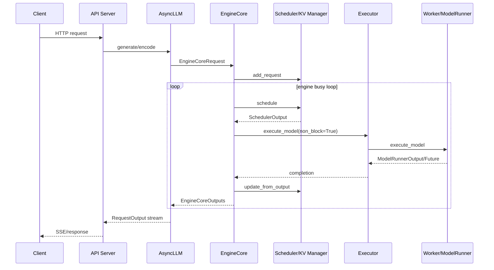

# vLLM 总体架构与源码导览

## 当前实现概览

`SOURCE_IMPLEMENTED`：当前 V1 架构把在线 API、异步客户端、EngineCore、Scheduler 和设备 Worker 分到不同职责域。官方架构说明同样将 Engine Core 定义为调度和 KV 管理者、Worker 定义为权重加载和执行者。

## 进程与状态所有权

### API/AsyncLLM

入口代码位于 `vllm/entrypoints/openai`、`vllm/entrypoints/launchers/api_server` 和 `vllm/v1/engine/async_llm.py`。这一层拥有客户端异步 queue、输出聚合、父子请求关系和流式响应，不拥有物理 KV block。

### EngineCore

`vllm/v1/engine/core.py:EngineCore` 是内循环控制面。初始化顺序为：加载 general plugins、构造 executor、探测内存并建立 KV cache config、构造 structured-output manager、构造 scheduler。`step()` 的核心顺序是：

1. `scheduler.schedule()`；
2. `model_executor.execute_model(..., non_block=True)`；
3. 等待或排队 future；
4. 取得 model output；
5. scheduler 更新请求和 KV 状态；
6. 生成 EngineCoreOutputs。

### Scheduler

`vllm/v1/core/sched/scheduler.py` 持有 waiting/running 请求、token budget、encoder budget、finished/failed 状态和逻辑 KV block ownership。它决定本 step 的新请求、恢复请求、scheduled token 数、cached request delta、block table 和 feature metadata。

### Executor/Worker

`vllm/v1/executor` 将 EngineCore 调用映射到单进程、多进程或 Ray worker。`vllm/v1/worker/worker_base.py` 定义 worker 生命周期，具体 runner 完成模型加载、输入 batch 更新、物理 KV 初始化、forward 和 sampling。

## 三条关键调用链

### 在线生成请求

`API route → serving layer → AsyncLLM.add_request → OutputProcessor.add_request → EngineCoreClient.add_request → EngineCore.preprocess_add_request/add_request → Scheduler.add_request`。

请求存在多个表示：协议 request、处理后的 EngineCoreRequest、scheduler `Request`、worker cached request state、输出处理器状态。它们不是一个共享对象，而依赖 request ID、增量消息和严格时序保持一致。

### continuous batching

`EngineCore.step → Scheduler.schedule → KVCacheManager.allocate_slots → SchedulerOutput → Executor.execute_model → Worker.execute_model → ModelRunner.execute_model → Scheduler.update_from_output`。

Prefill 和 Decode 不是两个完全独立的 engine；scheduler 用每请求 `num_computed_tokens` 与 token budget 决定当前 step 的工作。chunked prefill 会让一个 prompt 跨多个 step。

### 平台选择

`vllm.platforms.resolve_current_platform_cls_qualname()` 加载 builtin 和 `vllm.platform_plugins`。检测函数返回非空类名即视为激活。当前不允许同时激活两个 OOT platform，也不允许同时激活两个 builtin platform。

`INFERENCE`：一个 Engine 应按单平台理解。跨供应商 prefill/decode 或异构 worker 应在多个 Engine/服务间编排，而不是依赖一个 Engine 内的混合设备。

## 重要组件

| 组件 | 主要职责 | vendor 常见扩展方式 |
|---|---|---|
| `Platform` | 探测、设备语义、编译、通信、能力 hook | OOT platform class |
| `Scheduler` | admission、batch、preemption、逻辑 KV | 继承/替换/patch |
| `KVCacheManager` | block ownership、prefix cache | 复用或自定义 spec/coordinator |
| `Executor` | worker RPC、并行与完成 Future | uniproc/mp/Ray 或 vendor executor |
| `Worker` | 设备初始化、内存探测、KV 初始化 | vendor worker |
| `ModelRunner` | batch state、forward、sampling | 继承 GPU runner 或 native runner |
| Attention backend | metadata、KV layout、kernel | vendor backend/custom op |
| ModelRegistry/loader | 架构选择、权重加载 | general plugin 注册 |

## CUDA 历史假设

`SOURCE_IMPLEMENTED`：Platform 接口已经提供 OOT、dispatch key、compile backend、device communicator、IR kernel 等 hook，但代码库仍存在 CUDA graph、CUDA stream/event、NCCL、CUDA-visible-device 和 `GPUModelRunner` 命名/结构。

必须区分：

- 被 `current_platform` 正确隔离的 CUDA 优化；
- 名称是 GPU 但数据结构实际通用；
- OOT backend 必须 patch 或 override 的真实耦合。

Ascend 和 QAIC 继承 `GPUModelRunner`，说明其中有可复用的 request/batch 状态；同时也增加了跟随内部变化的风险。TPU 和 TT 使用更独立 runner，代价是重复实现更多控制逻辑。

## 架构评价

vLLM 的核心价值不只在 PagedAttention kernel，而在请求到 token block 的持续调度控制面。硬件 plugin 成功与否取决于它能否保持这些状态不变量，并把内部执行描述安全映射到本地 graph/runtime。

当前 entry point 是公开发现机制，但 `Platform`、`SchedulerOutput`、GPU runner 内部成员和 patch 点不应被视为稳定 ABI。vendor 必须用版本 pin、兼容分支和硬件 CI 管理升级。

