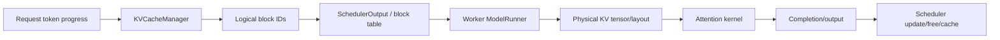

# vLLM 请求调度与 KV Cache

## 调度目标

Scheduler 每一步解决一个多资源装箱问题：在 token、序列、encoder、KV block、LoRA、grammar、KV transfer 和并行执行约束下选择请求。简单的 FCFS 只决定候选顺序，不等于完整 admission policy。

## 请求生命周期

```text
WAITING
  ├─资源满足→ RUNNING/PREFILL
  ├─grammar/KV 等待→ WAITING
  └─失败/取消→ FINISHED
RUNNING
  ├─继续 prefill/decode→ RUNNING
  ├─抢占→ PREEMPTED/WAITING
  ├─等待远端 KV→ WAITING_FOR_REMOTE_KVS
  └─完成/失败/取消→ FINISHED
```

实际状态以固定 revision 的 `RequestStatus` 和 scheduler 分支为准；上图是概念归纳。

## token budget 不是成本模型

`Scheduler.schedule()` 主要以本 step scheduled tokens、max sequences 和相关 feature budget 约束 batch。它适合动态 GPU workload，但不同后端会产生偏差：

- QAIC AoT 和 TPU/XLA 关心 shape bucket 与 padding；
- TT trace 关心可复用 trace 和 model-declared capacity；
- Ascend ACL Graph 关心 capture shape 和 host launch；
- MoE 还关心 expert imbalance、all-to-all 和 shared expert overlap。

因此第三方 scheduler override 的根源通常不是“厂商想重写”，而是上游成本模型缺少硬件特定维度。

## KV 的双重所有权

`SOURCE_IMPLEMENTED`：scheduler 侧的 `KVCacheManager`、coordinator 和 block pool 管理逻辑 block；worker/attention backend 管理物理 tensor、layout 和写入。



逻辑 block 分配成功并不表示设备已经写完。多 in-flight batch、pipeline parallel、异步 sampling 或 KV transfer 下，必须在 completion 边界之后回收。

## Prefix caching

prefix cache 命中以完整 block 为主要单位。全命中时仍需重算最后 token 以产生 logits。对 sliding-window、Mamba/hybrid attention，多个 KV group 的可复用前缀可能不同，因此当前实现引入 group/coordinator 和边界调和。

prefix identity 至少应绑定：token IDs、模型/权重、adapter、multimodal input、cache salt、KV dtype/layout 和位置语义。跨 Engine 或远端 KV 还需传输协议和握手 metadata。

## Preemption 和取消

抢占必须同步更新：请求的 computed token 位置、逻辑 block、worker cached state 和可能仍在执行的 device batch。取消则还涉及客户端输出 queue 和已提交设备工作的关系。

`UNKNOWN`：本次未在四种 vendor 硬件上验证 abort/preemption 与异步 graph 的原子性。因此 vendor 文档只描述源码策略，不宣称跨请求泄漏或竞态已经被完整测试。

## KV 容量推导

GPU 常通过 worker profile 得到可分配 device bytes，再用 KV spec 转成 block 数。静态或模型专用后端可能反向从“允许的总 token 数”声明容量。

近似关系：

```text
KV bytes/token ≈ 2 × layers × kv_heads × head_dim × dtype_bytes
最大并发上界 ≈ KV pool tokens / 每请求实际占用 tokens
```

GQA/MQA、MLA、量化 KV、sliding window、hybrid state 和 padding 会改变该公式。`max_model_len` 只约束单请求，不代表该长度下仍有可接受并发。

## 架构建议

- 将 `SchedulerOutput` 看作版本绑定的内部执行描述，而不是稳定跨 vendor IR。
- 为静态 graph 后端显式暴露 shape/bucket/padding 成本。
- 给物理 KV 写入和逻辑 block free 建立 completion/fence 契约。
- capacity negotiation 应同时返回 bytes、token capacity、layout、alignment 和 topology scope。
- 故障测试必须覆盖 abort、preempt、OOM、compile failure、collective timeout 和 KV transfer failure。

