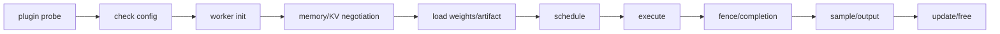

# 新硬件接入 vLLM 的架构指南

## 先定义支持域

在写 Platform 前固定：

- 设备 SKU 和单机/多机拓扑；
- 模型 family、任务类型、dtype/quantization；
- max context、目标并发和服务 SLO；
- eager、graph、AoT 或 model-owned execution；
- online/offline、TP/PP/DP/EP、P/D；
- 明确不支持的功能。

没有支持域，任何 fallback 都可能把错误配置静默变成低性能或错误结果。

## 四层接入模型

### 发现与配置层

实现 `vllm.platform_plugins`，probe 必须低副作用、可重复，并在 API、EngineCore、worker 进程得到一致结果。配置阶段在加载权重前拒绝不支持的组合。

### 控制层

先尝试复用 upstream Scheduler/KV Manager。只有存在可写清的不变量冲突时才扩展 scheduler，例如：

- 不允许 mixed prefill/decode；
- 必须固定 batch/context bucket；
- KV 必须按模型声明容量；
- graph 需要额外 output reservation；
- topology 形成一个逻辑设备组。

### 执行层

实现 Worker、ModelRunner、attention backend、communicator 和 model loader。不要仅因类名方便就继承 GPU runner；应列出所有继承成员，证明未触达 CUDA-only 状态。

### Release 层

发布 manifest、容器、model matrix、CI artifact 和回滚方法。插件 wheel 不是完整产品。

## 最小调用链

每条箭头都要有失败语义和所有者。

## KV 契约

至少定义：

- bytes/token 或 model-declared token pool；
- block size、alignment、group 和 physical layout；
- capacity 在不同 rank 是否一致；
- prefix-cache hash identity；
- preemption/abort 的 fence；
- remote KV 的握手、校验和失败 rollback；
- hybrid attention、MLA、Mamba 的 state；
- max context 与 concurrency 的联动。

## Shape/编译契约

静态后端应导出：

- 支持的 prefill/decode/verify buckets；
- padding 和拆批规则；
- compile/capture cache key；
- warmup 与启动预算；
- cache miss 行为；
- eager fallback 是否语义等价；
- compiler/runtime/firmware 升级失效条件。

推荐让 scheduler 能查询 cost/profile，而不是把 padding 隐藏在 runner。

## Sampling 契约

明确 host/device sampling、每请求 RNG、seed、abort/retry 后 RNG 推进、grammar、penalty、logprob、speculative acceptance 和 streaming 顺序。device-side sampling 需要 conformance test，而不是只比较 greedy token。

## 并行与拓扑

不要把设备 group 强塞进 CUDA ordinal 语义。为 physical device、logical rank、mesh coordinate、host 和 failure domain 定义明确类型。验证 TP/PP/DP/EP 的 rank mapping 和 collective completion。

## 测试阶梯

1. 无硬件 discovery 和 config unit test；
2. fake runner 的 request/KV lifecycle test；
3. 单设备 greedy 与 reference logits；
4. sampling、seed、logprob、structured output；
5. mixed request、abort、preempt、OOM；
6. graph/bucket/cache miss；
7. 多设备 collective 和 worker failure；
8. 长时间并发稳定性；
9. 完整模型 eval；
10. 固定 workload 性能。

## 选择接入范式

| 条件 | 建议 |
|---|---|
| PyTorch eager 语义和动态 shape 完整 | 窄 Platform/Worker/Attention plugin |
| runtime 是静态 graph/AoT | adapter + shape-aware scheduler contract |
| SPMD compiler 掌控布局和 collective | native runner + mesh/sharding config |
| 模型 program 决定 KV、trace、sampling | model-owned runner，必要时受控扩展 scheduler |
| 必须大规模 monkey patch | 记录每个 patch 的原符号、guard、版本和测试；推动上游 hook |

## 上游化决策

应优先上游化的是可泛化的能力表达：completion fence、shape profile、KV capacity/layout negotiation、device group type、scheduler cost hook。vendor-specific kernel、firmware workaround 和模型 program 留在 plugin。

## 完成定义

一个新后端只有在“可发现、可配置、可执行”之外，还证明请求隔离、KV 生命周期、sampling 语义、failure recovery、release reproducibility 和 workload 性能后，才可称为生产就绪。

