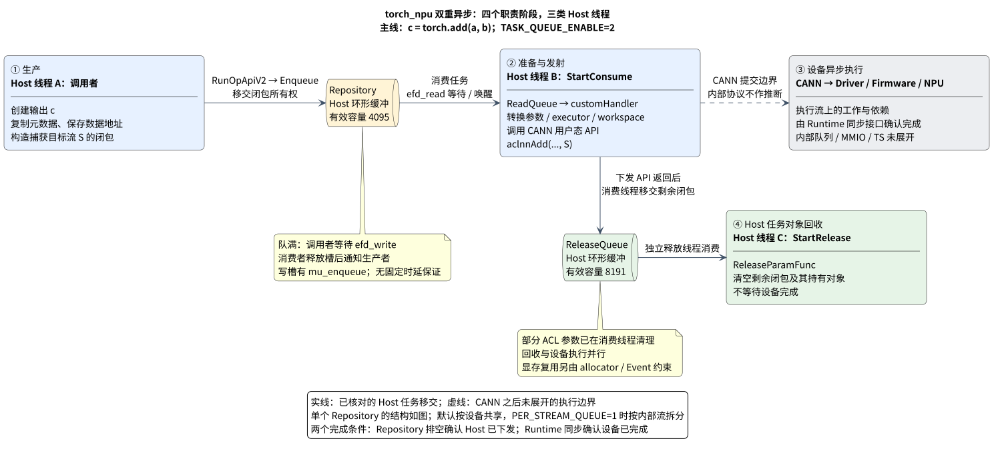

# torch_npu 双重异步架构：生产、下发、执行与回收

**核心问题是：在保持数据依赖和内存安全的前提下，让调用线程准备下一次计算、消费线程发射当前计算、设备执行已提交计算，同时进行 Host 对象回收。** `Repository`、Stream/Event、allocator 与同步接口分别约束这几个阶段，不能用一个“异步”概念代替它们。[1] [6] [8] [10] [13]

本文只沿 `c = torch.add(a, b)` 的正常 ACLNN Eager 路径展开：两个同设备的基础格式 NPU Tensor，普通内部流，不涉及图捕获、融合或 executor 缓存命中。主线取 `TASK_QUEUE_ENABLE=2`，以完整展示后台准备与发射；默认模式 1 的差异在第一节说明。

源码基线：`huawei/torch_npu` commit **`b262bae21efdcccc31c28fbb96ed85c6020df943`**，以及它固定的 `third_party/op-plugin` commit **`743b073b88a99a505ab7086823376ff15f0316be`**。加法包装代码属于该子模块，引用使用已保存的[原始源码快照](./assets/torch-npu-stream-event-taskqueue/README.md)。下文编号对应文末关键源码表。分析止于 CANN 用户态 ABI；不推断其内部 MMIO、Doorbell 或硬件 TS 实现，亦不提供未经实测的时延保证。

## 1. 双重异步解决的是两种不同的串行等待

### 设备异步不消除 Host 下发成本

`aclnnAdd` 的设备执行可以异步，发起它之前的 Host 工作仍要执行。源码中的加法先校验参数、计算输出形状并创建 `c`；随后还要表示输入输出的 dtype、shape、stride、数据地址，取得 executor 和 workspace 大小，必要时申请 workspace，最后进入 CANN 下发函数。没有 TaskQueue 时，这些调用沿当前调用线程执行；该线程要等这些 Host 工作返回，才能继续组织下一次计算。[1] [3]

这里的限制是**同一线程的工作串行**，不是调用被永久卡死。驱动/Runtime 异步只使调用者不必等待设备完成，并不能使描述符构造、Host 内存管理和 API 调用本身没有成本。`aclnn` 是 CANN 用户态算子接口，也不能直接等同于内核驱动入口。[1]

`Repository` 增加了另一层异步：调用线程把一个可执行闭包移交给后台线程，提前继续运行；后台线程再向设备提交工作。两处解耦分别是：

- **调用线程 → 消费线程：** 用 Host 队列分离生产与下发。
- **消费线程 → 设备：** 用 CANN 异步执行分离下发返回与计算完成。

参数回收另有一个 Host 分支，用于从连续下发路径移出部分对象析构工作。[3] [6] [7] [8]

### 全景：四个职责阶段，三类 Host 线程



[SVG](./assets/torch-npu-stream-event-taskqueue/torch_npu_pipeline_architecture.svg) · [PNG](./assets/torch-npu-stream-event-taskqueue/torch_npu_pipeline_architecture.png) · [PlantUML 源文件](./assets/torch-npu-stream-event-taskqueue/torch_npu_pipeline_architecture.puml)

图中的设备执行与 Host 回收是**并行分支**：消费线程调用 CANN 返回后，把剩余任务对象交给 ReleaseQueue；不是硬件执行完成后通知 ReleaseQueue。CANN 内部执行队列与 Repository 也不是同一个队列。[7] [8]

Host 工作分配由一个关键开关决定：

| 配置 | 调用线程保留的准备工作 | 消费线程执行的工作 |
| --- | --- | --- |
| `TASK_QUEUE_ENABLE=1`，本版本默认值 | 参数转换、GetWorkspaceSize、workspace 分配 | 闭包中的 `aclnnAdd` 下发及后续清理 |
| `TASK_QUEUE_ENABLE=2`，本文主线 | 复制必要元数据、保存数据地址和目标流、构造闭包 | 参数转换、GetWorkspaceSize、workspace 分配、`aclnnAdd` 下发及后续清理 |

证据：[1] [2]。两种模式都保留调用线程侧的输出 Tensor 创建；队列不会把全部 Eager 工作移到后台。

拓扑也独立可选：默认各设备使用其 default stream 对象挂载的一个 Repository，任务可以分别发往不同 CANN 流。`PER_STREAM_QUEUE=1` 时改用各内部流自己的 Repository，首次使用时创建消费/释放线程。[2] [6]

**架构推论：** 在有足够独立 Host 工作、CPU 资源及缓冲空间时，生产下一条任务可以与当前任务的下发重叠，从而减少 Host 供给不足引起的设备空闲。但队列不会提高单个阶段本身的处理能力：消费慢会积压，生产慢会断供，释放慢也会反向阻塞下发。源码支持“创造重叠条件”，不支持“彻底消除所有 Kernel Bubbles”。[4] [6] [8]

## 2. 一次加法如何完成三次所有权与执行责任转移

### 第一次：调用线程把闭包交给 Repository

`op_api::add(a,b,alpha)` 先创建结果 Tensor `c`，再进入 `EXEC_NPU_CMD(aclnnAdd, a, b, alpha, c)`。模式 2 在此捕获当前原生流 `S`，调用 `CopyTypesV2`，把 Tensor 的尺寸、步长等元数据及底层数据地址保存为参数副本，构造稍后执行的闭包。**任务中保存的是调用信息，不是 a、b 的数值数据副本。**[1] [9]

明确的脱离调用线程位置是 `OpCommand::RunOpApiV2 → enCurrentNPUStream → Repository::Enqueue`。`RunOpApiV2` 最初传入的名字与闭包地址指向调用栈；`WriteQueue → CopyFunc → ExecuteParasOpApi::Copy` 在入队返回前复制名字，并将闭包 move 到环形槽中的拥有型对象。随后调用栈可以结束，队列仍拥有可执行任务。此时 Python 获得 `c`，并不意味着其数据已经计算完成。[2] [3] [5]

环形缓冲预先分配 Host 内存，4096 个槽保留一个用于区分满与空，最多积压 4095 条任务。写入顺序是：**取得 `mu_enqueue` → 检查状态/容量 → 拷贝或移动槽内参数 → 内存屏障 → 推进 `write_idx`**。消费者据读写索引判断任务是否可取。[4] [5]

因此这里是带写入互斥锁的环形队列，不是无锁写入；预分配也不意味着闭包及元数据没有分配成本。屏障用于约束 Host 读写顺序，不提供“1 微秒内完成”的时延保证。[4] [9]

队满时，生产者重新检查容量后阻塞于 Linux `eventfd_read(efd_write)`；消费线程释放槽位后通知它重试。背压把有限内存约束传回生产者，避免无限积压。空闲稳定状态下，入队不等待设备；但首次 `INIT` 入队会先等待 Host 队列排空，再转为 `RUN`，不能把初始化时序当作稳态吞吐行为。[2] [4] [6]

### 第二次：消费线程执行闭包，跨过 CANN API 边界

`Repository::InitRepo` 创建 `StartConsume` 线程并绑定设备。队列有任务时它连续消费；队列空时等待 `efd_read`，入队方负责唤醒。模式 2 在进入阻塞前先执行有限次数的空队列查询，用额外 CPU 查询工作减少一部分睡眠/唤醒机会。[6]

主干只有这一条：

```text
StartConsume
  → Repository::Dequeue / ReadQueue
  → AsncExecFunc
  → ExecFuncOpApi
  → customHandler()
      转换参数 → aclnnAddGetWorkspaceSize → 必要时分配 workspace
      → aclnnAdd(workspace, size, executor, S)
```

`S` 已在调用线程中捕获，所以后台线程不会把任务错误地下发到自己的默认流。上述 `aclnnAdd` 调用是本次能确认的下层 ABI 边界；MMIO 写入、Doorbell 更新、设备描述符编码都不在这条源码链中，不能指定一个不存在于证据中的“写硬件寄存器函数”。[1] [7]

CANN 下发返回后，消费线程处理必要的 Host 清理、移交剩余闭包，再推进 Repository 的 `read_idx`。这个索引推进表示该任务已完成 Host 下发路径，不是 kernel 已执行完毕。[1] [8]

### 第三次：消费线程把剩余 Host 任务对象交给释放线程

`ReadQueue → ReleaseFunc → ReleaseQueue::PushToReleaseQueue` 移交任务对象；`CopyReleaseParamFunc` 将闭包移动到释放队列，`StartRelease → ReleaseParamFunc → ExecuteParasOpApi::Release` 最终清空闭包及其持有对象。[3] [7] [8]

从责任分配看，调用线程不能在入队后直接销毁队列仍要使用的任务；消费线程则可以把**剩余闭包的析构**延后，使这部分清理与后续下发重叠。这是由线程结构推导的收益，不是已测量的加速比例。ReleaseQueue 自身有限，满时消费线程会持续重试，所以回收能力不足仍会影响下发吞吐。[5] [8]

但“所有参数与 Tensor 都在释放线程释放”不符合这条主线：

| 资源 | 本次加法的实际处理 |
| --- | --- |
| 转换得到的 ACL 参数对象 | 闭包在 `aclnnAdd` 返回后调用 `ReleaseConvertTypes`，仍在消费线程处理 |
| 闭包及其元数据副本 | 移交 ReleaseQueue，稍后由释放线程清空 |
| 原始 Tensor / Storage | `TensorStruct` 只复制元数据和裸数据地址，未持有原 Tensor/Storage 引用，不能说全部 Tensor 随任务进入释放队列 |
| workspace Tensor | 模式 2 中是闭包执行期间的局部对象；其 C++ 生命周期不覆盖设备执行全过程 |

证据：[1] [3] [7] [9]。

**Host 参数清理不需要在此额外等待设备完成，但设备内存复用必须服从流顺序。** `NPUCachingAllocator` 按流管理内存块：同流复用依靠流内执行顺序；登记了其他使用流的块，在释放时记录 Event，查询完成后才能复用。它允许 Tensor 对象先结束生命周期而设备仍在使用底层内存，条件是相关流使用与依赖被正确建立。ReleaseQueue 并不承担设备完成通知或显存安全判定。[10]

## 3. Stream 与 Event：同时约束 Host 下发顺序和设备执行顺序

### 句柄表达顺序，不能直接解释成物理队列

继续使用这次加法：它的任务必须知道“把 a+b 放到哪条执行序列上”。`NPUStream` 内部保存 `c10::Stream`；设备索引与 StreamId 定位到 `LeakyStreamInternals`，其中的 `aclrtStream` 才是交给 CANN 的原生句柄。当前流是线程局部选择，内部流对象共享；任务入队时把选择固定下来。[2] [11]

普通 `NPUEvent` 在首次 record 时创建 `aclrtEvent` 并绑定记录设备。Stream/Event 创建封装接入 `libascendcl` 的 `aclrt*` 接口，但句柄是不透明的；本仓库没有给出“一条 NPUStream 等于一条物理硬件队列”的证明。[11] [12]

假设加法在流 A，后续消费者在流 B，依赖关系是：

```text
流 A：add(a,b) → record(eventA)
流 B：wait(eventA) → 使用 c 的后续计算
```

record 与 wait 都是可入 Repository 的任务。消费后分别执行 `aclrtRecordEvent(eventA,A)` 和 `aclrtStreamWaitEvent(B,eventA)`。后者向 Runtime 提交 B 的执行依赖，并未调用 `aclrtSynchronizeEvent` 让 CPU 等待加法完成。正常提交后，CPU 可以继续生产/发射，而依赖满足之前 B 的后续工作不能越过该等待。[12] [13]

可确认的是 **Runtime 接口承担跨流执行依赖**；其内部是否由某种 TS 指令、固件轮询或其他硬件机制实现，不能从 torch_npu 推断。“CPU 不必等设备完成”成立的同时，“CPU 不需要参与建立正确顺序”并不成立。

### 每流独立队列必须先修正 Host 的 record/wait 顺序

共享 Repository 时，调用方先入队 record、再入队 wait，可由同一个 consumer 按 FIFO 下发。换成 `PER_STREAM_QUEUE=1` 后，A/B 的 consumer 调度独立；A 的 record 仍在 Host 队列里时，B 可能已经具备调用 wait 的条件。**设备不能执行一个尚未正确提交给 Runtime 的依赖关系；Host FIFO 的拆分必须补充跨队列保序。**[2] [12]

正常路径的补偿机制很小，但不可省略：

1. `LaunchRecordTask` 在 record 入队前，增加 `NPUEventManager` 的未下发计数。
2. A 的 consumer 调用 `aclrtRecordEvent` 返回后，`RecordEventFunc` 减少计数。
3. B 的调用线程进入 `NPUEvent::block()` 时，循环检查 `IsEventRecorded()`，未清零则休眠 10 微秒；确认 record 已下发后，才提交 B 的 wait。[12] [13]

这形成两个不同条件：**Host 先保证 record 下发在 wait 下发之前；Runtime 再保证 A 的事件完成在 B 的后续计算之前。** `IsEventRecorded()` 在这里检查的是 Host 计数，不是硬件完成状态。等待它不会要求加法已经执行完；但它确实可能暂时阻塞 CPU 提交流 B 的 wait。[13]

## 4. 同步的代价：收回异步运行允许的进度差

### Drain Barrier 先等“已下发”，再等“已完成”

如果 `c` 留在设备继续计算，调用线程可以领先设备；如果 Python 现在要读取 `c` 的值，这个领先必须在读取前消除。源码中的主同步结构只有两个完成条件：

```text
相关 Host 任务全部完成下发
        ↓
Runtime 确认相关设备执行完成
        ↓
需要 Host 数据时进行同步 D2H 拷贝并返回结果
```

可以沿调用链分五个动作理解它，但不能将它写成五级独立硬件屏障，更不能把 ReleaseQueue 排空加入不存在的同步契约。[14] [15] [16]

1. **确定同步范围。** `torch.npu.synchronize(device)` 进入目标设备上下文，C++ 入口释放 GIL，调用 `npuSynchronizeDevice`；`.item()` 和默认阻塞 `.cpu()` 对应的后端路径使用当前相关流。[14] [16]
2. **把 Host 队列纳入等待。** 设备同步调用 `emptyAllNPUStream`；流同步在 `NPUStream` 转成原生 `aclrtStream` 时调用 `stream()`，它先排空对应 repo。异步发射用的 `stream(false)` 则刻意不做这一步。[11] [14]
3. **等待尚未下发的闭包被消费。** `MakeSureQueueEmpty` 设置 `need_empty`、屏障后二次检查索引，必要时等待 `efd_empty`。consumer 执行任务并移交回收对象，推进 `read_idx`；发现队列为空时通知等待者。正常状态下索引相等意味着 Host 下发结束，仍不意味着芯片空闲。[8] [15]
4. **等待 Runtime 完成。** 设备同步再调用 `AclrtSynchronizeDeviceWithTimeout`；流同步使用 `AclrtSynchronizeStreamWithTimeout`。先 drain 才能避免 Runtime 同步看不到仍滞留在 Host 队列中的加法。[11] [14] [16]
5. **返回或读取结果。** `synchronize()` 检查状态后返回；`.item()` 的 `_local_scalar_dense` 和默认阻塞 copy 路径在流同步后调用同步 `aclrtMemcpy`，然后才能让 Host 使用结果。[14] [16]

这里有三个直接影响正确性和性能的边界。设备同步的 Host drain 会遍历已初始化设备的相关 repo，但随后 Runtime device synchronize 针对当前设备；`.item()`/阻塞 copy 等待相关流，不能自动补齐错误的跨流依赖。`MakeSureQueueEmpty` 不禁止其他线程继续生产，因此不是对并发提交建立的永久静止状态。ReleaseQueue 可以仍有 Host 对象待清理，**计算同步并不保证全部析构都已完成**。[11] [14] [15] [8]

同步的代价来自等待实际剩余工作：Host 队列积压、Runtime 已提交工作、依赖等待，以及必要的 D2H 传输。频繁在短算子间取 Host 标量，会反复取消生产与设备执行的重叠机会；这是一项由同步位置推导的性能影响，不是固定微秒数。[14] [15] [16]

### 出错后停止正常发射，让等待者收到失败

异步把执行移出了调用线程，也把报错时间移到了后面。`ExecFuncOpApi` 捕获闭包异常并返回错误；`ReadQueue` 发现失败时记录当前算子信息，跳过未发射任务并转移其回收工作，再由 `CheckDeviceError` 分类设置队列状态。UCE 检查、HBM ECC、HCCS 链路错误分别有对应分支，不能把它们一律解释为可恢复或不可恢复。[7] [17]

进入对应故障状态后，consumer 不再正常消费发射；新的普通入队在状态检查处受阻。`ClearQueue` 修改索引，并通知 `efd_empty`、`efd_write`，让 drain 等待者和队满等待者获得继续检查状态的机会。**故障下的队列为空可能意味着任务被丢弃，必须连同错误状态解释。**[17]

异常通过后续 `Enqueue`、`MakeSureQueueEmpty` 或 Runtime 同步返回到调用线程。已提交到 CANN 的工作不因清空 Host 队列而自动撤销；较晚发生的设备错误也可能直到 Runtime 同步时才被发现。队列错误信息可以指出当时下发的算子，但源码明确提示异步栈可能不准确，因此不能承诺恢复最初 Python 调用点的精确 traceback。[14] [15] [17]

---

## 关键源码定位

`T` = 工作区 `huawei/torch_npu/`，固定提交 `b262bae21efdcccc31c28fbb96ed85c6020df943`。`P` = 该提交的 `third_party/op-plugin/`，固定提交 `743b073b88a99a505ab7086823376ff15f0316be`；链接指向保留原始行号的源码快照。表内路径与前缀合起来即为源码位置。

| 编号 | 主干职责 | 源码路径与行号 |
| --- | --- | --- |
| <a id="src-1"></a>1 | 加法及两种 Host 工作分配 | P/[op_plugin/ops/opapi/AddKernelNpuOpApi.cpp](./assets/torch-npu-stream-event-taskqueue/op-plugin-743b073/op_plugin/ops/opapi/AddKernelNpuOpApi.cpp)：**46–74,97–116**；`op_api::add`<br>P/[op_plugin/utils/op_api_common.h](./assets/torch-npu-stream-event-taskqueue/op-plugin-743b073/op_plugin/utils/op_api_common.h)：**343–493**；`EXEC_NPU_CMD_V1/V2` |
| <a id="src-2"></a>2 | 开关与 Repository 选择 | T/[torch_npu/csrc/core/npu/register/OptionsManager.cpp](../../huawei/torch_npu/torch_npu/csrc/core/npu/register/OptionsManager.cpp)：**599–642**；`GetTaskQueueEnable / GetPerStreamQueue`<br>T/[torch_npu/csrc/core/npu/NPUStream.cpp](../../huawei/torch_npu/torch_npu/csrc/core/npu/NPUStream.cpp)：**772–815**；`enCurrentNPUStream` |
| <a id="src-3"></a>3 | 闭包入队及所有权移动 | T/[torch_npu/csrc/framework/OpCommand.cpp](../../huawei/torch_npu/torch_npu/csrc/framework/OpCommand.cpp)：**234–280**；`OpCommand::RunOpApiV2`<br>T/[torch_npu/csrc/framework/NPUDefine.cpp](../../huawei/torch_npu/torch_npu/csrc/framework/NPUDefine.cpp)：**39–57**；`ExecuteParasOpApi::Copy / Release` |
| <a id="src-4"></a>4 | 环形写入与队满背压 | T/[torch_npu/csrc/core/npu/NPUQueue.cpp](../../huawei/torch_npu/torch_npu/csrc/core/npu/NPUQueue.cpp)：**153–157,363–391,652–722,858–860**；`WriteQueue / Enqueue / IsFullQueue` |
| <a id="src-5"></a>5 | 槽内对象构造与回收入口 | T/[torch_npu/csrc/framework/OpParamMaker.cpp](../../huawei/torch_npu/torch_npu/csrc/framework/OpParamMaker.cpp)：**674–727**；`CopyFunc / ReleaseFunc / NewFunc` |
| <a id="src-6"></a>6 | 线程创建、唤醒与消费 | T/[torch_npu/csrc/core/npu/NPUQueue.cpp](../../huawei/torch_npu/torch_npu/csrc/core/npu/NPUQueue.cpp)：**435–460,724–813,866–899**；`ReadQueue / Dequeue / StartConsume / InitRepo` |
| <a id="src-7"></a>7 | 执行回调和回收移交 | T/[torch_npu/csrc/framework/OpParamMaker.cpp](../../huawei/torch_npu/torch_npu/csrc/framework/OpParamMaker.cpp)：**527–576,785–832**；`ExecFuncOpApi / AsncExecFunc / CopyReleaseParamFunc / ReleaseParamFunc` |
| <a id="src-8"></a>8 | 释放线程与消费索引推进 | T/[torch_npu/csrc/core/npu/NPUQueue.cpp](../../huawei/torch_npu/torch_npu/csrc/core/npu/NPUQueue.cpp)：**512–522,911–1007**；`ReadQueue 提交回收 / ReleaseQueue / StartRelease` |
| <a id="src-9"></a>9 | Tensor 参数副本的真实内容 | P/[op_plugin/utils/op_api_common_base.h](./assets/torch-npu-stream-event-taskqueue/op-plugin-743b073/op_plugin/utils/op_api_common_base.h)：**119–150,263–296**；`TensorStruct / ReleaseConvertTypes / CopyTypesV2`<br>P/[op_plugin/utils/op_api_common.cpp](./assets/torch-npu-stream-event-taskqueue/op-plugin-743b073/op_plugin/utils/op_api_common.cpp)：**1298–1322**；`CopyTypeV2(Tensor)` |
| <a id="src-10"></a>10 | 设备内存复用约束 | T/[torch_npu/csrc/core/npu/NPUCachingAllocator.cpp](../../huawei/torch_npu/torch_npu/csrc/core/npu/NPUCachingAllocator.cpp)：**68–92,1551–1594,1671–1676,3412–3429,3457–3488**；`DeviceCachingAllocator::free / recordStream / insert_events / process_events` |
| <a id="src-11"></a>11 | Stream 句柄及隐式 drain | T/[torch_npu/csrc/core/npu/NPUStream.h](../../huawei/torch_npu/torch_npu/csrc/core/npu/NPUStream.h)：**21–108**；`NPUStream / operator aclrtStream`<br>T/[torch_npu/csrc/core/npu/NPUStream.cpp](../../huawei/torch_npu/torch_npu/csrc/core/npu/NPUStream.cpp)：**33–86,235–268,469–496,867–874**；`LeakyStreamInternals / 流创建 / stream` |
| <a id="src-12"></a>12 | Event 创建与 block | T/[torch_npu/csrc/core/npu/NPUEvent.cpp](../../huawei/torch_npu/torch_npu/csrc/core/npu/NPUEvent.cpp)：**100–147,250–265**；`NPUEvent::record / block / createEvent`<br>T/[torch_npu/csrc/core/npu/interface/AclInterface.cpp](../../huawei/torch_npu/torch_npu/csrc/core/npu/interface/AclInterface.cpp)：**26–29,197–210,314–343**；`libascendcl 注册 / Stream、Event 创建` |
| <a id="src-13"></a>13 | record/wait 下发及计数 | T/[torch_npu/csrc/core/npu/interface/AsyncTaskQueueInterface.cpp](../../huawei/torch_npu/torch_npu/csrc/core/npu/interface/AsyncTaskQueueInterface.cpp)：**201–238,255–292**；`EventTask::LaunchRecordTask / LaunchWaitTask`<br>T/[torch_npu/csrc/framework/OpParamMaker.cpp](../../huawei/torch_npu/torch_npu/csrc/framework/OpParamMaker.cpp)：**619–654**；`RecordEventFunc / WaitEventFunc`<br>T/[torch_npu/csrc/core/npu/NPUEventManager.cpp](../../huawei/torch_npu/torch_npu/csrc/core/npu/NPUEventManager.cpp)：**108–144**；`未下发 record 计数` |
| <a id="src-14"></a>14 | 设备同步入口与范围 | T/[torch_npu/npu/utils.py](../../huawei/torch_npu/torch_npu/npu/utils.py)：**65–75**；`synchronize`<br>T/[torch_npu/csrc/npu/Module.cpp](../../huawei/torch_npu/torch_npu/csrc/npu/Module.cpp)：**677–682**；`THNPModule_npuSynchronize`<br>T/[torch_npu/csrc/core/npu/NPUStream.cpp](../../huawei/torch_npu/torch_npu/csrc/core/npu/NPUStream.cpp)：**638–685,727–752**；`emptyAllNPUStream / npuSynchronizeDevice` |
| <a id="src-15"></a>15 | Host drain 等待/错误检查 | T/[torch_npu/csrc/core/npu/NPUQueue.cpp](../../huawei/torch_npu/torch_npu/csrc/core/npu/NPUQueue.cpp)：**225–360,785–798**；`MakeSureQueueEmpty / efd_empty 通知` |
| <a id="src-16"></a>16 | 标量与阻塞 D2H 回传 | T/[torch_npu/csrc/aten/common/LocalScalarDenseNpu.cpp](../../huawei/torch_npu/torch_npu/csrc/aten/common/LocalScalarDenseNpu.cpp)：**14–32**；`_local_scalar_dense`<br>T/[torch_npu/csrc/aten/common/CopyKernel.cpp](../../huawei/torch_npu/torch_npu/csrc/aten/common/CopyKernel.cpp)：**125–160,260–269,452–472**；`copy_between_host_and_device / copy_d2h / copy_`<br>T/[torch_npu/csrc/framework/utils/CalcuOpUtil.cpp](../../huawei/torch_npu/torch_npu/csrc/framework/utils/CalcuOpUtil.cpp)：**159–161,262–290**；`AclrtMemcpyWithModeSwitch → aclrtMemcpy` |
| <a id="src-17"></a>17 | 故障分类、阻断与唤醒 | T/[torch_npu/csrc/core/npu/NPUQueue.cpp](../../huawei/torch_npu/torch_npu/csrc/core/npu/NPUQueue.cpp)：**394–433,461–489,546–563,580–614,735–752,831–836**；`CheckDeviceError / ReadQueue / ThrowDeviceError / Enqueue / ClearQueue` |

[1]: #src-1
[2]: #src-2
[3]: #src-3
[4]: #src-4
[5]: #src-5
[6]: #src-6
[7]: #src-7
[8]: #src-8
[9]: #src-9
[10]: #src-10
[11]: #src-11
[12]: #src-12
[13]: #src-13
[14]: #src-14
[15]: #src-15
[16]: #src-16
[17]: #src-17
