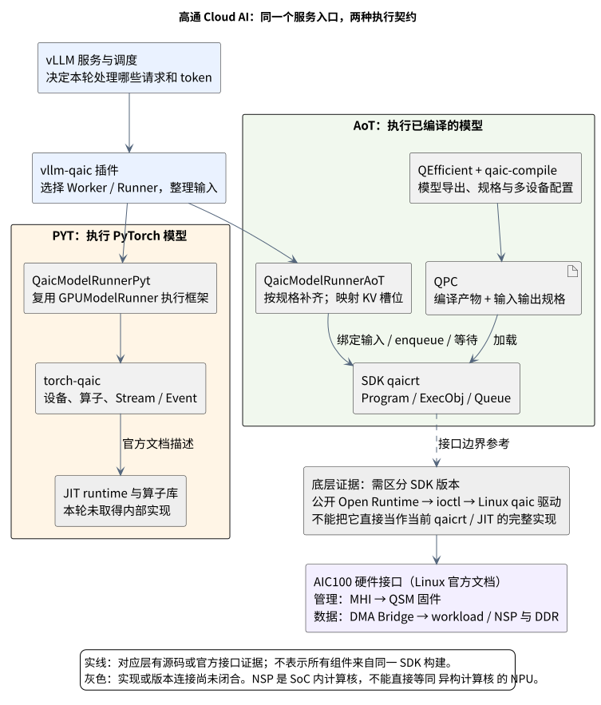
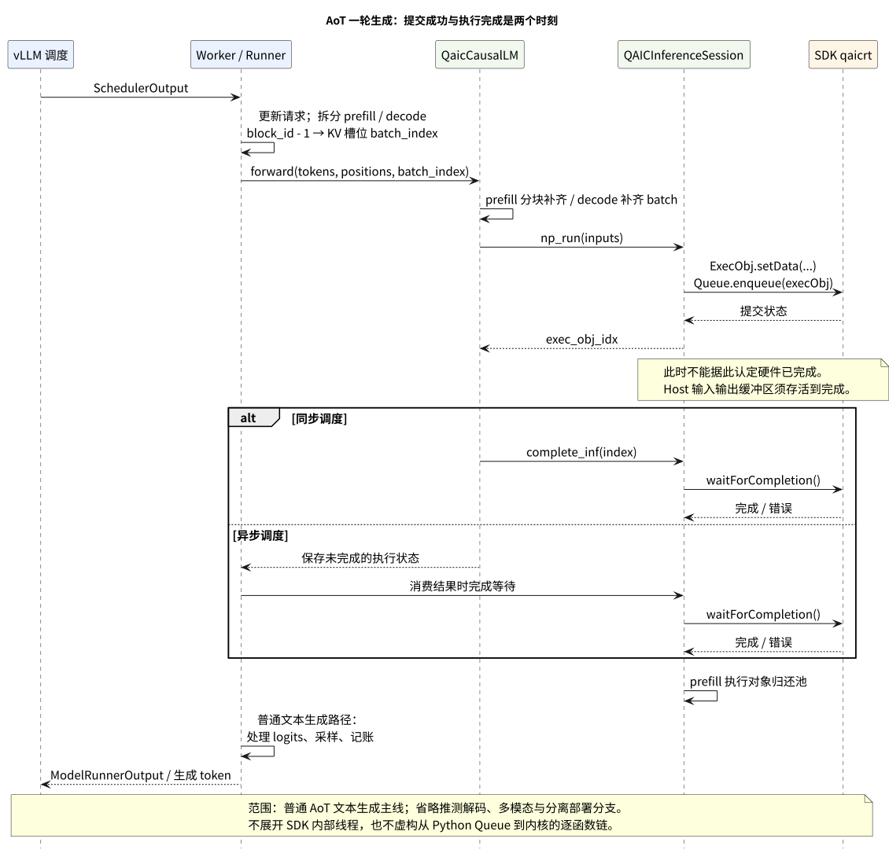

# 高通 Cloud AI 推理栈：一次请求怎样从 vLLM 到达硬件

> 历史合并稿：2026-09-23 起请优先阅读独立重写的 [vLLM-QAIC 后端](./28-vllm-qaic-backend.md) 与 [torch-qaic 设备后端](./29-torch-qaic-backend.md)。本稿保留供追溯，不再作为当前调研入口。

> 状态：vLLM/AoT 路径已做源码追踪；独立 torch-qaic backend 的内部实现仍待取得 SDK 材料核查，不能视为全栈调研完成。
>
> 调研日期：2026-09-22。范围：服务器侧 Qualcomm Cloud AI 100 / Ultra 相关软件栈，重点是本地 `vllm-qaic` 的 AoT 与 PyTorch 两条路径。本文是源码与官方资料调研，没有运行加速卡测试，不给出实测性能结论。
>
> 讲解方式参考：[vLLM-Ascend](https://terapines.feishu.cn/wiki/VaYkwLW6yi1mM2kO4vYcrlDontf)（读取 revision 15）、[torch_npu](https://terapines.feishu.cn/wiki/Q08QwpXPqixhYWktsM7cDyQznMh)（读取 revision 21）。二者只用于参考“全景 → 一次执行 → 关键机制 → 接口边界”的组织方式，不作为高通技术事实的证据。本文为新写调研，不是飞书文档迁移。

## 1. 先用三分钟理解这套系统

**vLLM 负责安排请求，高通后端负责把这些请求变成设备能执行的工作。当前插件提供两套不同的执行契约。**

- **AoT 路线**：先把模型加工成 QPC 编译产物，服务运行时准备输入、选择已编译的规格、执行程序。可以类比“先准备好生产线，再不断投入不同批次的原料”。
- **PyTorch / PYT 路线**：保留 PyTorch 模型执行，通过 `torch-qaic` 把设备张量与算子接入高通运行时。可以类比“按程序中的操作逐步安排工作”。此处描述的是上层契约，不能据此断言底层每个算子都独立启动，也不能断言完全没有 JIT 编译。

这两种比喻只帮助理解。具体证据是平台选择两个 Worker、两个 Runner，以及官方对 torch-qaic/JIT runtime 的说明。[S1](#s1)[S2](#s2)[W1](#w1)

| 名称 | 用普通话解释 | 在链路中的职责 |
| --- | --- | --- |
| vLLM Scheduler | 排班员 | 决定这一轮哪些请求获得多少 token 计算机会 |
| vllm-qaic | 高通适配层 | 接入平台，选择执行路线，整理输入、KV 状态和输出 |
| Worker / Runner | 执行负责人 / 数据整理与模型调用者 | 初始化设备环境；把调度结果变成一次模型执行 |
| QEfficient | 模型加工前端 | 转换模型、导出图、组织编译参数并调用编译器 |
| QPC | 已编译的程序包 | 供 Runtime 加载；携带可读取的 I/O 描述与允许的 shape |
| qaicrt | SDK 的运行时 Python 接口 | 管理 Context、Program、执行对象和提交队列 |
| torch-qaic | PyTorch 的高通设备后端 | 提供 `qaic` 张量执行以及插件所调用的设备接口 |
| NSP / QSM | 计算核 / 设备上的管理者 | NSP 运行工作负载；QSM 固件负责设备管理 |

表中软件职责可在 [S1–S12] 找到源码入口；硬件名称来自 [W2](#w2)。**名字里有 `GPUModelRunner` 不代表在用 GPU；AoT 出现 CPU/NumPy 输入也不代表模型主体在 CPU 上运行。** 两者都是上层复用/数据组织方式，要看真正调用的后端。[S2](#s2)[S6](#s6)[S10](#s10)



图中的灰色框表示证据边界。尤其不能把公开 Open Runtime 当成当前 SDK `qaicrt` 的完整源码，也不能把 AoT 的下层调用直接套到 PYT 路线。[S14–S16]

## 2. 谁决定走哪条路？

插件通过 `setup.py` 的 `vllm.platform_plugins` 注册 `vllm_qaic:register`，返回 `vllm_qaic.platform.QaicPlatform`。这是启动入口。[S1](#s1)

当前 `platform_base.py` 检查是否能找到 `torch_qaic`：找不到时 `is_aot=True`，选 `QaicWorkerAoT`；找到时选 `QaicWorkerPyt`。安装脚本也在 AoT 环境移除 torch-qaic，PYT 环境从 SDK 的 wheel 安装它。[S2](#s2)[S3](#s3)

**因此，不能只看到 `--enforce-eager` 就断言整个执行路线已经切换。** 当前代码的 Worker 选择依据是包是否存在，而部分 cache/executor 配置又读取 `enforce_eager`。研究或复现实验必须同时记录安装环境与启动参数。[S2](#s2)[S4](#s4)

| 对比项 | AoT 路线 | PYT 路线 |
| --- | --- | --- |
| 模型执行入口 | `QaicModelRunnerAoT → QaicCausalLM` | `QaicModelRunnerPyt → GPUModelRunner` |
| 模型来源与交付 | 调用 QEfficient 编译，或加载已有 QPC | 复用 vLLM 模型执行框架 |
| 推理时交给下层什么 | 编译程序的 I/O 数据、shape、KV 槽位等 | PyTorch 张量与算子调用 |
| 可直接核查的下一层 | `qaicrt.Program / ExecObj / Queue` 调用点 | `torch.qaic`、SDPA、设备 Stream/Event 等调用点 |
| 多设备表达 | `device_group`，加载时设置 `devMapping` | 设备 rank 与 `torch.distributed`/`qccl` 接口 |
| 当前证据缺口 | SDK Python Queue 与公开 Runtime 的实现对应关系 | torch-qaic allocator、stream、算子到 JIT 的内部实现 |

证据：[S2](#s2)[S5–S12]。这不是厂商所有版本的能力矩阵，而是本次固定源码版本的路径比较。

### AoT、Eager、Graph Replay 不能混为一谈

AoT 是预先编译模型，再加载执行产物。Eager 是上层按 PyTorch 操作执行。Graph Replay 则是捕获一次执行序列以后重复回放；它不等同于前两者。

当前插件把 vLLM `compilation_config.mode` 改成 `NONE`，PYT Worker 的 `capture_model()` 调用也被注释掉。因此不能根据架构 README 中的 “torch.compile / JIT” 字样，就宣称当前插件已经启用了 vLLM 图编译或图捕获回放。与此同时，官方明确描述了 torch-qaic 的 JIT runtime；**关闭 vLLM 编译不等于底层没有编译。** [S4](#s4)[S13](#s13)[W1](#w1)

## 3. AoT 启动时：先准备好能执行的程序

### 3.1 QEfficient 和编译器各干什么？

`QaicCausalLM` 的加载流程首先检查用户是否提供有效 QPC。没有时，构建 QEfficient 模型，再调用 `qeff_model.compile(...)`；有时直接进入加载。这里的“提前编译”是相对模型执行而言，编译也可能发生在服务启动过程中，并不要求必须独立离线完成。[S5](#s5)

在本轮核查的 QEfficient `qaic-compile` 分支中，前端把以下信息交给外部编译器：[S11](#s11)

| 编译输入 | 为什么运行时需要关心 |
| --- | --- |
| 导出的 ONNX 图 | 描述要计算的模型 |
| `specializations.json` | 声明要编译的输入尺寸组合；运行时需要选取可接受的规格 |
| `custom_io.yaml` | 声明部分 I/O 的精度，与 Host 数据类型衔接 |
| MDP 配置 | 声明多设备分区/切分配置，影响运行时设备映射 |
| 硬件、核数等编译选项 | 指定编译目标和资源配置 |

前端最终启动 `/opt/qti-aic/exec/qaic-compile`，输出目录内以 `programqpc.bin` 判断缓存产物是否存在；编译命令、规格、I/O 和 MDP 等参数参与缓存 hash。[S11](#s11)

**能够核实的是前端如何组织编译输入与产物；本轮没有取得该图编译器内部 lowering、指令生成与内存规划的完整实现。** Linux 文档提到的公开 Compute 编译工具链也不能不经核查就等同于这个 ONNX 图编译器。[W2](#w2)

### 3.2 Runtime 如何把 QPC 变成可执行实例？

当前 `QAICInferenceSession` 有一条很清楚的初始化链：[S6](#s6)

1. 用 `device_ids` 建立 `Context` 和 `Queue`。
2. 打开 `Qpc`，读取 I/O 描述，包括 binding 名称、数据类型、尺寸和 `allowed_shapes`。
3. 创建 `Program`；多设备时设置 `devMapping`，然后 `load()`。
4. `activate()` 后创建可复用的 `ExecObj`。
5. 为 prefill 准备执行对象池，为 decode 保留执行对象。

可以把 Program 理解为“准备运行的程序实例”，ExecObj 理解为“装有这一轮输入输出绑定的执行单”。两者分开，才能在模型长期驻留时不断提交新的输入。

## 4. 一次生成请求怎样走完？

以下只讲普通文本生成主线，先不加入多模态、推测解码和 prefill/decode 分离部署。

- **Prefill**：处理用户已有的提示词，建立后续生成需要的历史状态。
- **Decode**：使用历史状态继续生成 token。
- **KV Cache**：模型保存的历史 Key/Value 数据，让下一步不必从头计算全部历史。



### 4.1 调度结果变成设备输入

Worker 把 `SchedulerOutput` 交给 Runner。Runner 更新请求状态、准备 token/position，然后分开组织 prefill 与 decode 输入，调用 `QaicCausalLM.forward(...)`。[S7](#s7)

**说明性例子，数字不是设备固定参数：** 假设 QPC 的 prefill 长度为 128，一个 150-token 提示词会按当前 `_run_prefill` 逻辑补齐到 256，再分成两个 128-token chunk。假设 decode 编译 batch 为 4，当前只有 3 个请求，代码会填充剩余行，并把无效 token/position/batch index 标为 `-1`。[S8](#s8)

这解释了“输入请求可变”如何与“编译规格固定”共存：Host 调度可以变化，Runner 用分块、补齐和已编译规格来适配。它不意味着 QPC 接受任意 shape。

### 4.2 提交和完成是两个时刻

`np_run()` 把 NumPy 输入整理为连续数组，调用 `ExecObj.setData()` 或 `setDataWithSlices()`，再执行 `Queue.enqueue()`，返回执行对象索引。[S6](#s6)

`complete_inf()` 才调用 `waitForCompletion()`，检查错误，并把 prefill 执行对象归还池。同步调度会在提交后等待；异步调度把未完成状态交给后续结果处理路径。[S6](#s6)[S8](#s8)[S9](#s9)

这里有两个容易讲错的点：

- 入队函数可能因为没有可用 prefill 执行对象而等待，所以“异步提交”不代表任意调用都绝不阻塞。
- 入队成功不代表硬件完成；Runner 的源码明确要求 NumPy 缓冲区存活到完成等待之后。过早回收/复用输入输出缓冲区会破坏执行。[S6](#s6)[S7](#s7)

普通生成分支在得到 logits 后调用采样逻辑，再完成请求记账和输出。当前还有异步输出、设备端采样等条件分支，不能把“CPU 采样”当成所有模式的固定属性。[S9](#s9)[S4](#s4)

## 5. KV Cache：谁管槽位，谁管真实数据？

### 5.1 AoT 的 block 在这里更像请求槽位

在常规非 `enforce_eager` 配置分支中，插件把 `block_size` 设成 `max_model_len`。AoT Worker 按 `max_num_seqs + 1` 组织常规 block 数；Runner 将 block table 的第一列减 1，得到传入模型的 `batch_index`。[S4](#s4)[S7](#s7)[S10](#s10)

**源码推断：这条路径把 vLLM block 管理接口适配成了整段上下文槽位管理，而非直接照搬“小页 KV 按需增长”的语义。** 判断依据是上述三处实现的组合，而不只是看到变量名里有 `block_table`。

例如请求被分配 block 3，传给模型的是 `batch_index=2`。这个值标识使用哪个 KV 槽位，不是 Host 可以直接解引用的设备物理地址。[S7](#s7)

QEfficient 的 cache 更新代码利用 `batch_index` 和 position 做 scatter/gather；导出/编译代码包含 retained-state 命名和配置。插件从 QPC binding 中解析 KV 的 shape/type/size，并提供 KV slicing/handoff 接口。[S6](#s6)[S12](#s12)

因此应该区分三层：

| 层次 | 负责什么 | 不应混淆成什么 |
| --- | --- | --- |
| vLLM / Runner | 请求与逻辑槽位的关联 | 设备 DDR 的物理分配器 |
| 编译图与 KV 更新算子 | KV 张量形状、按槽位/位置读写的语义 | 通用 PyTorch caching allocator |
| SDK Runtime / 设备侧 | 承接程序与 retained state 执行 | 本轮已完全查明的固件物理内存布局 |

AoT 的 `determine_available_memory()` 在这里按 block 数、page size 和层数计算返回值，并非调用 SDK 查询剩余 DDR。读方法名时尤其需要核对实现。[S10](#s10)

### 5.2 PYT 路线也不能直接贴“原生 PagedAttention”标签

当前默认 Attention 类是 `QAicTorchAttentionBackend`。实际 decoder 路径维护按 `req_id` 索引的字典，首次为请求申请最大上下文长度的 K/V Tensor，把新 K/V 写入，最后调用 `scaled_dot_product_attention`。[S2](#s2)[S12](#s12)

文件顶部仍有“decode 回退 CPU paged attention”的注释，但所核查的 `forward → _run_sdpa_decode_forward` 函数体不是这条调用链。**本文以函数体为准，不用旧注释推导当前执行位置或分页机制。** SDPA 内部如何落到 torch-qaic/JIT 内核，本轮没有对应实现证据。[S12](#s12)

AoT 和 PYT 都能服务请求，不代表它们的 KV 组织、内存复用或功能限制相同。当前非 AoT 路径显式拒绝推测解码和分离部署，并关闭异步调度。[S4](#s4)

## 6. 独立的 PyTorch backend：torch-qaic

**torch-qaic 是需要单独研究的设备后端；vllm-qaic 只是它的上层使用者之一。** 官方 PyTorch workflow 明确说明：torch-qaic 注册加速器，JIT runtime 执行算子，预写算子库支持多个 NSP。[W1](#w1)

### 6.1 跳出 vLLM 后，能看到什么？

QEfficient 的微调代码提供了独立于 vLLM 的使用证据。以下引用均来自 `qualcomm/efficient-transformers`，commit `e127a6b741d8b71e81134cc76c7e24cea7210cdc`：

| 维度 | 可核查的调用证据 | 证据边界 |
| --- | --- | --- |
| PyTorch 模型与张量 | [train_utils.py:186–201](https://github.com/quic/efficient-transformers/blob/e127a6b741d8b71e81134cc76c7e24cea7210cdc/QEfficient/finetune/utils/train_utils.py#L186-L201) 将 batch 搬到所选设备并执行模型 | 调用端证据，不是后端 dispatcher 实现 |
| 反向与优化器 | [train_utils.py:250–261](https://github.com/quic/efficient-transformers/blob/e127a6b741d8b71e81134cc76c7e24cea7210cdc/QEfficient/finetune/utils/train_utils.py#L250-L261) 调用 backward、scaler/optimizer step | 证明存在微调执行路径，不证明每个算子都在设备上执行 |
| 混合精度 | [helper.py:178–196](https://github.com/quic/efficient-transformers/blob/e127a6b741d8b71e81134cc76c7e24cea7210cdc/QEfficient/finetune/utils/helper.py#L178-L196) 选择 `torch.qaic.amp.GradScaler` | AMP 对外接口；内部数值实现未取得 |
| 算子逐项核对 | [helper.py:126–175](https://github.com/quic/efficient-transformers/blob/e127a6b741d8b71e81134cc76c7e24cea7210cdc/QEfficient/finetune/utils/helper.py#L126-L175) 使用 `torch_qaic.debug.OpByOpVerifierMode` 与 CPU 结果比较 | 后端已有独立的调试接口 |
| 设备 profiling | [helper.py:206–233](https://github.com/quic/efficient-transformers/blob/e127a6b741d8b71e81134cc76c7e24cea7210cdc/QEfficient/finetune/utils/helper.py#L206-L233) 调用 `torch_qaic.profile` | 可确认启停接口，未分析 trace 格式 |

[官方微调文档](https://quic.github.io/efficient-transformers/source/release/v1.21.6/source/finetune.html)还提供 `QAIC_DEBUG=1` 用于了解 CPU fallback 算子。因此“模型放到了 qaic”不能替代算子覆盖与 fallback 调研。

### 6.2 分发位置与源码可见性必须分别核查

2026-09-22 补充核查：

- [插件安装说明](https://github.com/qualcomm/vllm-qaic/blob/3212cc670130b7e5290b429f781dc978d7ecf430/docs/docs/getting_started/installation/pyt_mode.md#L32-L54)要求 Apps SDK 使用 `--install-torch-qaic`，然后安装 `/opt/qti-aic/integrations/torch_qaic/py312/` 下的 wheel。
- [官方 SDK 下载说明](https://quic.github.io/cloud-ai-sdk-pages/latest/Getting-Started/Installation/download-sdks.html)指向登录 Qualcomm Package Manager 下载 Apps/Platform SDK。
- GitHub 仓库搜索 `torch-qaic`、`torch_qaic` 未返回同名仓库；另查 `qualcomm`/`quic` 组织相关仓库。这个搜索结果不构成“后端一定闭源”的证明。
- 当前机器没有 `/opt/qti-aic`；检查 pip 缓存与 Downloads 未找到名称匹配的 torch-qaic 包。尚未取得 SDK 安装包或 wheel，因此不知道其中包含哪些 Python/C++ 源文件、头文件和二进制。

**当前状态应表述为：独立 backend 已确认，使用接口已有证据，内部实现调研尚未完成。** 下一步的直接材料是匹配版本的 Apps SDK/torch-qaic 包：先检查包内容与 native 库依赖，再追设备注册、allocator、stream/event、算子 dispatch/fallback、JIT 和通信。不能以本地没有源码为由，直接把这些问题从调研中排除。

### 6.3 vLLM 使用这个 backend 的哪些接口？

`QaicWorkerPyt.init_device()` 设置 `qaic:<local_rank>`，建立分布式环境，清理设备缓存并做内存快照；然后创建 `QaicModelRunnerPyt`。Runner 复用父类执行，局部适配 QAIC 设备信息与 profiling。[S2](#s2)[S13](#s13)

| 想查的问题 | 本轮已找到的证据 | 尚不能断言的实现 |
| --- | --- | --- |
| PyTorch 设备怎么表达 | 平台声明 `PrivateUse1`；Worker 使用 `torch.device('qaic:…')` | torch-qaic 内部注册实现细节 |
| 显存怎么管理 | `empty_cache()`、memory snapshot 和内存 profiling 调用点 | allocator 的分桶、split/merge、回收与 OOM 策略 |
| Stream/Event 怎么使用 | Runner wrapper 替换 Event/Stream；调用 `qaic.synchronize()` | stream 与硬件队列是否一一对应、事件如何编码 |
| Attention 怎么进入设备 | 请求 K/V Tensor 与 SDPA 调用 | kernel 选择、融合与底层任务下发 |
| 多卡通信怎么走 | 平台选择 `qccl`，communicator 继承默认分布式实现 | QCCL 算法、传输介质、通信与计算重叠方式 |

依据：[S2](#s2)[S12](#s12)[S13](#s13)；官方 PyTorch workflow 确认了设备注册、JIT runtime 和预写算子库的角色。[W1](#w1) SDK wheel 是安装入口，本轮未取得可核查这些内部机制的 torch-qaic 源码，因此不仿照 torch_npu 文档补写一个未经证实的“双级队列”或 allocator 架构。

## 7. Runtime 再往下：区分控制通路和数据通路

### 7.1 公开 Runtime 能追到 ioctl，但不能伪造版本连接

本轮另外读取了高通公开 `software-kit-for-qualcomm-cloud-ai-100`，固定 commit 见附录。在这个仓库内部可以闭合：[S14–S16]

```text
QExecObj::run
  → preTransform
  → submit → QNeuralnetwork::enqueueData → runExecute
      → QAIC_DEV_CMD_EXECUTE / PARTIAL_EXECUTE → ioctl
  → finish → QNeuralnetwork::wait
      → QAIC_DEV_CMD_WAIT_EXEC → ioctl
  → postTransform
```

这里 `run()` 自身组合了提交与等待。它和插件 `Queue.enqueue()` 后再 `waitForCompletion()` 的上层 API 形态不同。**本轮没有证明当前 SDK Python Queue 如何调用这份公开源码，以上是公开 Runtime 自身的已核查链路，不是跨版本拼接出的完整调用栈。**

| 接口层 | 关键对象/API | 交接的内容 |
| --- | --- | --- |
| 插件 → SDK | `Qpc.getIoDescriptor()` | 编译产物的输入输出契约 |
| 插件 → SDK | `Program.load()/activate()` | 程序实例与目标设备映射 |
| 插件 → SDK | `ExecObj.setData()`、`Queue.enqueue()`、`waitForCompletion()` | 本轮缓冲区、提交、完成 |
| 公开 Runtime → Driver | `CREATE_BO / ATTACH_SLICE_BO` | 数据传输缓冲区及其切片描述 |
| 公开 Runtime → Driver | `EXECUTE_BO / WAIT_BO` | 提交数据传输/执行相关请求并等待 |
| 公开 Runtime → Driver | `MANAGE` | 设备管理请求 |

前三行由 [S6](#s6) 支持，后三行由 [S16](#s16) 与 [W3](#w3) 支持。BO 是这里的数据通路对象，不能直接解释成 PyTorch 张量在设备 DDR 上的一次 malloc。

### 7.2 Driver、Firmware 与硬件分别做什么？

Linux 官方 AIC100 文档描述：管理请求经 MHI 到 QSM 固件；工作负载数据经 DMA Bridge。NSP 执行 workload，DDR 保存程序和数据。DMA Bridge 的通道有请求/响应 FIFO，FIFO 内存位于 Host，硬件寄存器维护队列位置。[W2](#w2)

Linux QAIC 驱动文档进一步明确：`MANAGE` 承载 NNC 管理请求；`EXECUTE_BO` 成功只代表已排队，`WAIT_BO` 等待完成或超时。内核并不理解所有透传管理命令的语义，不能把全部设备资源管理都归给 Driver。[W3](#w3)

这能解释“加载/激活一次，随后多次送入输入”的分工；但 QSM 内部调度、编译后 NSP 程序细节和当前 SDK 的执行协议扩展仍在本轮证据之外。

## 8. 多设备：一张卡、一个 QID、一个 NSP 是三回事

官方管理文档把 QID/deviceID 定义为 SoC 的标识；官方 model-sharding 文档举例说明 Ultra 一张卡含 4 个 SoC，每个 SoC 通常使用 16 个 NSP 核。**不能把一张卡、一个可见设备和一个内部核都叫成同一种 device。** [W4](#w4)[W5](#w5)

AoT Session 接收一组 device IDs，多设备时将其拼成 `ProgramProperties.devMapping`；AoT Worker 的框架并行初始化使用 `world_size=1` 和 TP/PP 为 1，注释明确把实际 TP 交给 `device-group`。QEfficient 另一端生成/传递 MDP 编译配置。[S6](#s6)[S10](#s10)[S11](#s11)

**源码推断：这条 AoT 路径可以让一个 Host Worker 管理一个跨设备编译程序，并不要求每个设备都对应一个 vLLM TP Worker。** 这是一种集成方式，不能外推成“所有高通多卡执行都如此”。PYT 路线仍有 rank 和 `qccl` 后端。[S2](#s2)[S13](#s13)

官方多设备文档说明通信与 PCIe 拓扑、P2P 支持有关；因此“多卡能执行”和“多卡一定更快”是两件事。本文没有带宽或吞吐实测。[W5](#w5)

## 9. 对异构加速器软硬件设计应带走哪些问题？

本节是**研究启示与待验证问题，不是高通事实，也不替代既定硬件设计决策**。

| 硬件架构约束 | 高通案例提供的观察角度 | 仍必须在目标硬件上验证 |
| --- | --- | --- |
| CIMD 统一控制语义 | Host Worker 的数量可以与内部计算资源数量解耦 | 一个 cluster 的提交、完成、错误传播是否有明确的统一语义 |
| 16 个 NPU 的 Local DRAM | 编译产物、设备映射和内部核应分层表达 | 每个 NPU 的容量、地址、分片布局如何表达；不能把高通 DDR 描述套成 16 份 Local DRAM |
| 动态内存能力 | AoT 槽位/retained state 与 PYT 张量分配应分别研究 | Eager 动态申请、AoT 预规划与 KV 生命周期各由谁负责 |
| cluster 内 placement/同步 | 编译器分区配置与运行时设备映射需要契约 | placement 是否随产物交付；跨 NPU 数据依赖/fence 如何绑定到执行 |

最值得继续做的是两个可验证的小闭环：一个验证“编译模型＋多个 KV 槽位＋请求完成后复用”，一个验证“Eager 张量申请＋一次算子＋跨流依赖＋安全释放”。二者分别给出正确性和资源生命周期证据后，再讨论能统一哪些接口。

## 10. 本轮结论的适用范围

- 本文核查的是下述 commit 中的具体路径，不把某版 SDK 文档或仓库 README 当成所有版本能力承诺。
- `vllm-qaic` 与 QEfficient 是分别固定的源码快照，未验证两者与已安装 SDK 的组合兼容性。
- 高通源码 checkout 没有被修改。未在硬件上编译模型、执行推理或测量性能。
- 本轮最重要的开放问题是：当前 torch-qaic 内部实现、当前 SDK `qaicrt` 与公开 Runtime 的对应关系，以及编译产物到设备内存/NSP 的完整映射。

## 附录 A：版本与源码证据

本地路径相对工作区 `/home/yyl/workspace/llmss/engine/vllm`。正文 `[S…]` 编号对应以下可复核入口；链接固定 commit，避免后续行号漂移。

| 仓库 | 实际读取位置 | 固定 commit |
| --- | --- | --- |
| vllm-qaic | `vllm-qaic/`；`qualcomm/vllm-qaic` 是指向它的链接 | `3212cc670130b7e5290b429f781dc978d7ecf430` |
| efficient-transformers | `qualcomm/efficient-transformers/` | `e127a6b741d8b71e81134cc76c7e24cea7210cdc` |
| 公开 QAIC Runtime | `/tmp/qaic-runtime-research-20260922/`，本轮只读浅克隆；以下永久链接用于复核 | `c9479bedd44a1fdca6833462b2a3e20836390e9c` |


<a id="s1"></a>

**S1 · 插件入口**

- [setup.py:313–316](https://github.com/qualcomm/vllm-qaic/blob/3212cc670130b7e5290b429f781dc978d7ecf430/setup.py#L313-L316)
- [vllm_qaic/__init__.py:32–39](https://github.com/qualcomm/vllm-qaic/blob/3212cc670130b7e5290b429f781dc978d7ecf430/vllm_qaic/__init__.py#L32-L39)

<a id="s2"></a>

**S2 · 平台分流与 PYT Runner**

- [vllm_qaic/platform_base.py:48–71](https://github.com/qualcomm/vllm-qaic/blob/3212cc670130b7e5290b429f781dc978d7ecf430/vllm_qaic/platform_base.py#L48-L71)
- [vllm_qaic/worker/model_runner.py:326–386](https://github.com/qualcomm/vllm-qaic/blob/3212cc670130b7e5290b429f781dc978d7ecf430/vllm_qaic/worker/model_runner.py#L326-L386)

<a id="s3"></a>

**S3 · 环境与 torch-qaic wheel**

- [scripts/install.sh:160–173](https://github.com/qualcomm/vllm-qaic/blob/3212cc670130b7e5290b429f781dc978d7ecf430/scripts/install.sh#L160-L173)
- [scripts/install.sh:211–226](https://github.com/qualcomm/vllm-qaic/blob/3212cc670130b7e5290b429f781dc978d7ecf430/scripts/install.sh#L211-L226)
- [requirements/pyt.txt:1–8](https://github.com/qualcomm/vllm-qaic/blob/3212cc670130b7e5290b429f781dc978d7ecf430/requirements/pyt.txt#L1-L8)

<a id="s4"></a>

**S4 · executor、功能限制、KV 配置与关闭 vLLM compile**

- [vllm_qaic/platform_base.py:248–256](https://github.com/qualcomm/vllm-qaic/blob/3212cc670130b7e5290b429f781dc978d7ecf430/vllm_qaic/platform_base.py#L248-L256)
- [vllm_qaic/platform_base.py:282–313](https://github.com/qualcomm/vllm-qaic/blob/3212cc670130b7e5290b429f781dc978d7ecf430/vllm_qaic/platform_base.py#L282-L313)
- [vllm_qaic/platform_base.py:387–409](https://github.com/qualcomm/vllm-qaic/blob/3212cc670130b7e5290b429f781dc978d7ecf430/vllm_qaic/platform_base.py#L387-L409)

<a id="s5"></a>

**S5 · QPC 校验、编译与加载入口**

- [vllm_qaic/model_loader/qaic.py:1364–1369](https://github.com/qualcomm/vllm-qaic/blob/3212cc670130b7e5290b429f781dc978d7ecf430/vllm_qaic/model_loader/qaic.py#L1364-L1369)
- [vllm_qaic/model_loader/qaic.py:1398–1424](https://github.com/qualcomm/vllm-qaic/blob/3212cc670130b7e5290b429f781dc978d7ecf430/vllm_qaic/model_loader/qaic.py#L1398-L1424)
- [vllm_qaic/model_loader/qaic.py:1505–1511](https://github.com/qualcomm/vllm-qaic/blob/3212cc670130b7e5290b429f781dc978d7ecf430/vllm_qaic/model_loader/qaic.py#L1505-L1511)
- [vllm_qaic/model_loader/qaic.py:1556–1579](https://github.com/qualcomm/vllm-qaic/blob/3212cc670130b7e5290b429f781dc978d7ecf430/vllm_qaic/model_loader/qaic.py#L1556-L1579)

<a id="s6"></a>

**S6 · Session、I/O、设备映射、执行对象与完成等待**

- [vllm_qaic/model_loader/qaic_session_np.py:63–114](https://github.com/qualcomm/vllm-qaic/blob/3212cc670130b7e5290b429f781dc978d7ecf430/vllm_qaic/model_loader/qaic_session_np.py#L63-L114)
- [vllm_qaic/model_loader/qaic_session_np.py:123–228](https://github.com/qualcomm/vllm-qaic/blob/3212cc670130b7e5290b429f781dc978d7ecf430/vllm_qaic/model_loader/qaic_session_np.py#L123-L228)
- [vllm_qaic/model_loader/qaic_session_np.py:416–426](https://github.com/qualcomm/vllm-qaic/blob/3212cc670130b7e5290b429f781dc978d7ecf430/vllm_qaic/model_loader/qaic_session_np.py#L416-L426)
- [vllm_qaic/model_loader/qaic_session_np.py:542–583](https://github.com/qualcomm/vllm-qaic/blob/3212cc670130b7e5290b429f781dc978d7ecf430/vllm_qaic/model_loader/qaic_session_np.py#L542-L583)
- [vllm_qaic/model_loader/qaic_session_np.py:628–663](https://github.com/qualcomm/vllm-qaic/blob/3212cc670130b7e5290b429f781dc978d7ecf430/vllm_qaic/model_loader/qaic_session_np.py#L628-L663)

<a id="s7"></a>

**S7 · 调度输入、槽位映射与缓冲区生命周期**

- [vllm_qaic/worker/worker.py:773–777](https://github.com/qualcomm/vllm-qaic/blob/3212cc670130b7e5290b429f781dc978d7ecf430/vllm_qaic/worker/worker.py#L773-L777)
- [vllm_qaic/worker/model_runner.py:814–816](https://github.com/qualcomm/vllm-qaic/blob/3212cc670130b7e5290b429f781dc978d7ecf430/vllm_qaic/worker/model_runner.py#L814-L816)
- [vllm_qaic/worker/model_runner.py:1055–1115](https://github.com/qualcomm/vllm-qaic/blob/3212cc670130b7e5290b429f781dc978d7ecf430/vllm_qaic/worker/model_runner.py#L1055-L1115)
- [vllm_qaic/worker/model_runner.py:1218–1276](https://github.com/qualcomm/vllm-qaic/blob/3212cc670130b7e5290b429f781dc978d7ecf430/vllm_qaic/worker/model_runner.py#L1218-L1276)

<a id="s8"></a>

**S8 · AoT forward、prefill 补齐与 decode 补齐**

- [vllm_qaic/model_loader/qaic.py:208–273](https://github.com/qualcomm/vllm-qaic/blob/3212cc670130b7e5290b429f781dc978d7ecf430/vllm_qaic/model_loader/qaic.py#L208-L273)
- [vllm_qaic/model_loader/qaic.py:707–738](https://github.com/qualcomm/vllm-qaic/blob/3212cc670130b7e5290b429f781dc978d7ecf430/vllm_qaic/model_loader/qaic.py#L707-L738)
- [vllm_qaic/model_loader/qaic.py:759–824](https://github.com/qualcomm/vllm-qaic/blob/3212cc670130b7e5290b429f781dc978d7ecf430/vllm_qaic/model_loader/qaic.py#L759-L824)
- [vllm_qaic/model_loader/qaic.py:828–895](https://github.com/qualcomm/vllm-qaic/blob/3212cc670130b7e5290b429f781dc978d7ecf430/vllm_qaic/model_loader/qaic.py#L828-L895)

<a id="s9"></a>

**S9 · 异步输出等待、采样与记账**

- [vllm_qaic/worker/model_runner.py:240–282](https://github.com/qualcomm/vllm-qaic/blob/3212cc670130b7e5290b429f781dc978d7ecf430/vllm_qaic/worker/model_runner.py#L240-L282)
- [vllm_qaic/worker/model_runner.py:944–955](https://github.com/qualcomm/vllm-qaic/blob/3212cc670130b7e5290b429f781dc978d7ecf430/vllm_qaic/worker/model_runner.py#L944-L955)
- [vllm_qaic/worker/model_runner.py:1329–1410](https://github.com/qualcomm/vllm-qaic/blob/3212cc670130b7e5290b429f781dc978d7ecf430/vllm_qaic/worker/model_runner.py#L1329-L1410)
- [vllm_qaic/worker/model_runner.py:1447–1461](https://github.com/qualcomm/vllm-qaic/blob/3212cc670130b7e5290b429f781dc978d7ecf430/vllm_qaic/worker/model_runner.py#L1447-L1461)

<a id="s10"></a>

**S10 · AoT KV 容量计算与框架并行环境**

- [vllm_qaic/worker/worker.py:632–645](https://github.com/qualcomm/vllm-qaic/blob/3212cc670130b7e5290b429f781dc978d7ecf430/vllm_qaic/worker/worker.py#L632-L645)
- [vllm_qaic/worker/worker.py:704–771](https://github.com/qualcomm/vllm-qaic/blob/3212cc670130b7e5290b429f781dc978d7ecf430/vllm_qaic/worker/worker.py#L704-L771)
- [vllm_qaic/worker/model_runner.py:1780–1810](https://github.com/qualcomm/vllm-qaic/blob/3212cc670130b7e5290b429f781dc978d7ecf430/vllm_qaic/worker/model_runner.py#L1780-L1810)

<a id="s11"></a>

**S11 · QEfficient 导出、编译器、规格、MDP 与缓存**

- [QEfficient/base/modeling_qeff.py:450–483](https://github.com/quic/efficient-transformers/blob/e127a6b741d8b71e81134cc76c7e24cea7210cdc/QEfficient/base/modeling_qeff.py#L450-L483)
- [QEfficient/base/modeling_qeff.py:1165–1179](https://github.com/quic/efficient-transformers/blob/e127a6b741d8b71e81134cc76c7e24cea7210cdc/QEfficient/base/modeling_qeff.py#L1165-L1179)
- [QEfficient/base/modeling_qeff.py:1216–1343](https://github.com/quic/efficient-transformers/blob/e127a6b741d8b71e81134cc76c7e24cea7210cdc/QEfficient/base/modeling_qeff.py#L1216-L1343)
- [QEfficient/utils/constants.py:124–124](https://github.com/quic/efficient-transformers/blob/e127a6b741d8b71e81134cc76c7e24cea7210cdc/QEfficient/utils/constants.py#L124-L124)

<a id="s12"></a>

**S12 · 两条路线的 KV/Attention 语义**

- [QEfficient/transformers/cache_utils.py:450–481](https://github.com/quic/efficient-transformers/blob/e127a6b741d8b71e81134cc76c7e24cea7210cdc/QEfficient/transformers/cache_utils.py#L450-L481)
- [QEfficient/transformers/cache_utils.py:546–573](https://github.com/quic/efficient-transformers/blob/e127a6b741d8b71e81134cc76c7e24cea7210cdc/QEfficient/transformers/cache_utils.py#L546-L573)
- [QEfficient/transformers/models/modeling_auto.py:3046–3068](https://github.com/quic/efficient-transformers/blob/e127a6b741d8b71e81134cc76c7e24cea7210cdc/QEfficient/transformers/models/modeling_auto.py#L3046-L3068)
- [vllm_qaic/attention/backends/qaic_attn.py:300–326](https://github.com/qualcomm/vllm-qaic/blob/3212cc670130b7e5290b429f781dc978d7ecf430/vllm_qaic/attention/backends/qaic_attn.py#L300-L326)
- [vllm_qaic/attention/backends/qaic_attn.py:337–451](https://github.com/qualcomm/vllm-qaic/blob/3212cc670130b7e5290b429f781dc978d7ecf430/vllm_qaic/attention/backends/qaic_attn.py#L337-L451)

<a id="s13"></a>

**S13 · PYT 设备、内存、图捕获边界与通信**

- [vllm_qaic/worker/worker.py:251–338](https://github.com/qualcomm/vllm-qaic/blob/3212cc670130b7e5290b429f781dc978d7ecf430/vllm_qaic/worker/worker.py#L251-L338)
- [vllm_qaic/worker/worker.py:342–407](https://github.com/qualcomm/vllm-qaic/blob/3212cc670130b7e5290b429f781dc978d7ecf430/vllm_qaic/worker/worker.py#L342-L407)
- [vllm_qaic/worker/worker.py:481–488](https://github.com/qualcomm/vllm-qaic/blob/3212cc670130b7e5290b429f781dc978d7ecf430/vllm_qaic/worker/worker.py#L481-L488)
- [vllm_qaic/worker/model_runner.py:1956–1966](https://github.com/qualcomm/vllm-qaic/blob/3212cc670130b7e5290b429f781dc978d7ecf430/vllm_qaic/worker/model_runner.py#L1956-L1966)
- [vllm_qaic/distributed/communicator.py:6–17](https://github.com/qualcomm/vllm-qaic/blob/3212cc670130b7e5290b429f781dc978d7ecf430/vllm_qaic/distributed/communicator.py#L6-L17)

<a id="s14"></a>

**S14 · 公开 Runtime 的 submit / finish / run**

- [lib/core/src/QExecObj.cpp:183–246](https://github.com/quic/software-kit-for-qualcomm-cloud-ai-100/blob/c9479bedd44a1fdca6833462b2a3e20836390e9c/lib/core/src/QExecObj.cpp#L183-L246)
- [lib/core/src/QExecObj.cpp:280–311](https://github.com/quic/software-kit-for-qualcomm-cloud-ai-100/blob/c9479bedd44a1fdca6833462b2a3e20836390e9c/lib/core/src/QExecObj.cpp#L280-L311)

<a id="s15"></a>

**S15 · 公开 Runtime 的 enqueue / wait / runExecute**

- [lib/network-driver/src/QNeuralNetwork.cpp:473–529](https://github.com/quic/software-kit-for-qualcomm-cloud-ai-100/blob/c9479bedd44a1fdca6833462b2a3e20836390e9c/lib/network-driver/src/QNeuralNetwork.cpp#L473-L529)
- [lib/network-driver/src/QNeuralNetwork.cpp:612–628](https://github.com/quic/software-kit-for-qualcomm-cloud-ai-100/blob/c9479bedd44a1fdca6833462b2a3e20836390e9c/lib/network-driver/src/QNeuralNetwork.cpp#L612-L628)

<a id="s16"></a>

**S16 · 公开 Runtime 到 ioctl 的边界**

- [lib/runtime-platform/src/dev/aic100/QRuntimePlatformDeviceAic100.cpp:71–148](https://github.com/quic/software-kit-for-qualcomm-cloud-ai-100/blob/c9479bedd44a1fdca6833462b2a3e20836390e9c/lib/runtime-platform/src/dev/aic100/QRuntimePlatformDeviceAic100.cpp#L71-L148)
- [lib/runtime-platform/src/os/linux/QOsal.cpp:490–508](https://github.com/quic/software-kit-for-qualcomm-cloud-ai-100/blob/c9479bedd44a1fdca6833462b2a3e20836390e9c/lib/runtime-platform/src/os/linux/QOsal.cpp#L490-L508)

## 附录 B：官方资料与复核说明

以下资料访问日期均为 2026-09-22。SDK 文档有明确版本路径；Linux 网页是滚动文档，与本轮固定 Runtime commit 不保证属于同一发行组合。

<a id="w1"></a>

- **W1**：[Cloud AI SDK 1.21：PyTorch Workflow](https://quic.github.io/cloud-ai-sdk-pages/1.21/Getting-Started/PyTorch-Workflow/Eager-Mode-Finetune/index.html)。用于确认 torch-qaic、JIT runtime 与算子库的角色，未将 fine-tuning 页面当作 vLLM 功能矩阵。

<a id="w2"></a>

- **W2**：[Linux 官方 AIC100 硬件与使用流程说明](https://docs.kernel.org/accel/qaic/aic100.html)。用于管理/数据通路、NSP/QSM/DDR 与 DMA FIFO 边界；不用于外推所有 Ultra SKU 的容量或当前 SDK 的完整行为。

<a id="w3"></a>

- **W3**：[Linux 官方 QAIC Driver / uAPI](https://docs.kernel.org/accel/qaic/qaic.html)。用于 IOCTL 的提交、等待与管理协议语义。

<a id="w4"></a>

- **W4**：[Cloud AI SDK 1.12：System Management](https://quic.github.io/cloud-ai-sdk-pages/1.12/Getting-Started/System-Management/system-management/)。用于 QID 对应 SoC 的术语定义。

<a id="w5"></a>

- **W5**：[Cloud AI SDK 1.18：Model Sharding](https://quic.github.io/cloud-ai-sdk-pages/1.18/Getting-Started/Features/model_sharding/)。用于 Ultra 卡/SoC/核层级、多设备编译配置与 PCIe/P2P 拓扑约束。

复核时优先沿正文问题找到对应 S 编号，再打开固定 commit 的源码；不要只搜索同名函数后混用另一份 checkout。`qualcomm/cloud-ai-sdk-pages` 本地 checkout 只有入口 README，本轮具体 SDK 页面通过官方站点读取。

图源与复用：[全景图 PlantUML](./assets/qualcomm-stack/qualcomm_stack_component.puml)、[时序图 PlantUML](./assets/qualcomm-stack/qualcomm_request_sequence.puml)。同目录提供 SVG 和 PNG；[源码定位清单](./assets/qualcomm-stack/source-manifest.json)记录路径、commit 和行号。两图已本地渲染并检查中文、布局和文字可读性。
