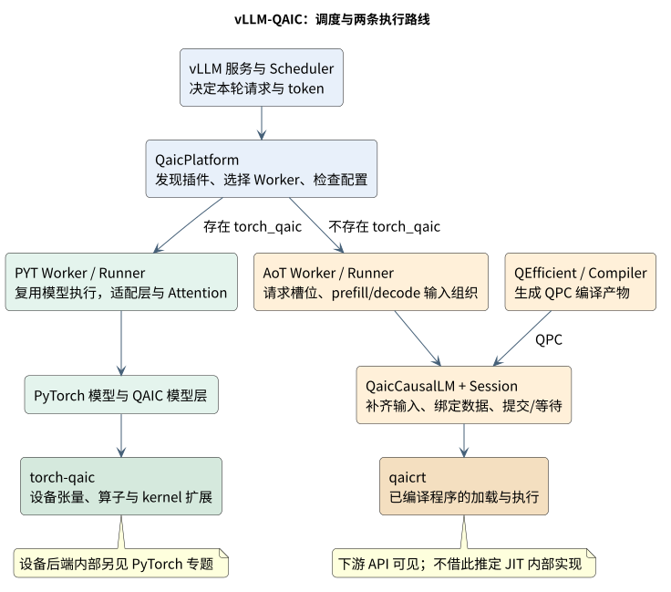
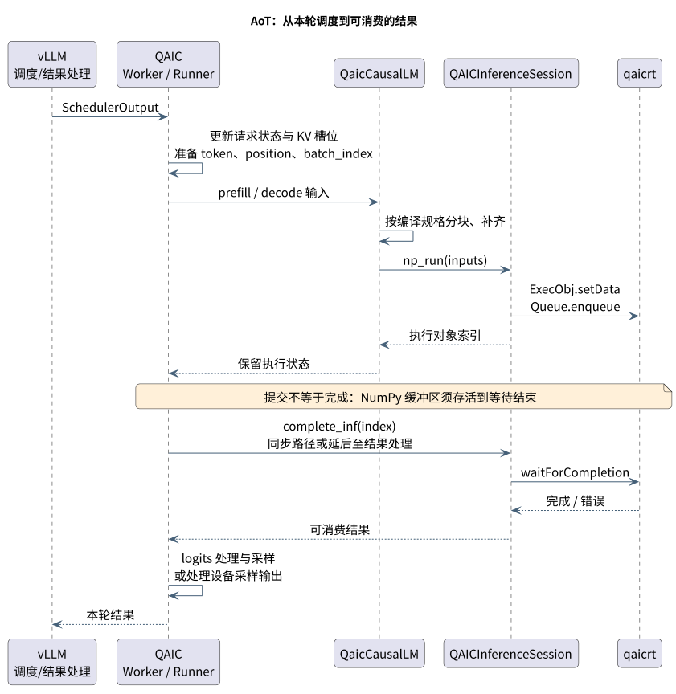

# vLLM-QAIC：高通 vLLM 后端的职责、执行流程与接口

> 调研日期：2026-09-23。本文独立研究 `vllm-qaic`，面向需要理解服务框架如何适配高通硬件的读者。
> 讲解结构参考 [vLLM-Ascend](https://terapines.feishu.cn/wiki/VaYkwLW6yi1mM2kO4vYcrlDontf)，读取 revision 15；高通结论重新以源码核查。
> PyTorch 设备后端另见 [torch-qaic 专题](./29-torch-qaic-backend.md)。本篇止于插件交给下游的接口，不代替设备后端实现分析。

## 1. 它解决什么问题？

用户发送提示词后，vLLM 需要安排哪些请求先算、每轮算多少 token、保存哪些历史状态。`vllm-qaic` 的任务是把这些服务端安排转换成高通执行路径能接受的输入，并把结果交回 vLLM。

**可以把它理解为“服务调度与计算后端之间的适配层”。** 从 `SchedulerOutput` 进入两个 Worker 的 `execute_model()`，再进入各自 Runner，能看到这一交接。PYT Worker 调用模型 Runner；AoT Worker 则使用 QPC 模型执行包装。[worker.py:574–581](https://github.com/qualcomm/vllm-qaic/blob/3212cc670130b7e5290b429f781dc978d7ecf430/vllm_qaic/worker/worker.py#L574-L581)；[worker.py:632–698](https://github.com/qualcomm/vllm-qaic/blob/3212cc670130b7e5290b429f781dc978d7ecf430/vllm_qaic/worker/worker.py#L632-L698)；[model_runner.py:1055–1115](https://github.com/qualcomm/vllm-qaic/blob/3212cc670130b7e5290b429f781dc978d7ecf430/vllm_qaic/worker/model_runner.py#L1055-L1115)

先区分四个词：

| 词 | 本文中的意思 |
| --- | --- |
| Worker | 一个执行工作单元，负责初始化环境和协调模型执行 |
| ModelRunner | 组织本轮 token、位置与状态，实际调用模型 |
| Prefill / Decode | 处理已有提示词 / 根据历史状态继续生成 token |
| KV Cache | 模型保留的历史 Key/Value 数据，是请求执行状态的一部分 |

### 1.1 插件提供两个执行入口

| 路线 | 模型如何执行 | 插件主要适配什么 |
| --- | --- | --- |
| PYT | 运行 PyTorch 模型，使用 torch-qaic 设备后端 | QAIC Worker、模型层替换、Attention、设备接口与内存统计 |
| AoT | 加载并执行预编译的 QPC 程序 | 编译配置、程序加载、固定规格输入、KV 槽位、提交与完成 |

平台定义 `QaicWorkerPyt` 与 `QaicWorkerAoT`；PYT Runner 继承 `GPUModelRunner`，AoT Runner 则实现自己的输入准备与执行过程。这里的类名复用不代表使用 NVIDIA GPU。[platform_base.py:48–71](https://github.com/qualcomm/vllm-qaic/blob/3212cc670130b7e5290b429f781dc978d7ecf430/vllm_qaic/platform_base.py#L48-L71)；[model_runner.py:326–386](https://github.com/qualcomm/vllm-qaic/blob/3212cc670130b7e5290b429f781dc978d7ecf430/vllm_qaic/worker/model_runner.py#L326-L386)；[model_runner.py:1055–1115](https://github.com/qualcomm/vllm-qaic/blob/3212cc670130b7e5290b429f781dc978d7ecf430/vllm_qaic/worker/model_runner.py#L1055-L1115)

## 2. 从插件发现到模型可执行

### 2.1 vLLM 如何找到它？

`setup.py` 注册 `vllm.platform_plugins` 下的 `qaic = vllm_qaic:register`；`register()` 返回 `vllm_qaic.platform.QaicPlatform`。平台的预注册逻辑导入 patch、扩展量化相关配置。**OOT 表示独立安装的插件，并不意味着完全没有运行时替换上游行为。** [setup.py:309–320](https://github.com/qualcomm/vllm-qaic/blob/3212cc670130b7e5290b429f781dc978d7ecf430/setup.py#L309-L320)；[__init__.py:32–39](https://github.com/qualcomm/vllm-qaic/blob/3212cc670130b7e5290b429f781dc978d7ecf430/vllm_qaic/__init__.py#L32-L39)；[platform.py:23–48](https://github.com/qualcomm/vllm-qaic/blob/3212cc670130b7e5290b429f781dc978d7ecf430/vllm_qaic/platform.py#L23-L48)

### 2.2 如何选择 Worker？

当前平台用 `find_spec('torch_qaic')` 判断安装环境：存在则选择 PYT Worker，否则选择 AoT Worker。PYT Worker 构造函数另有 `assert enforce_eager`。因此环境与参数必须匹配，不能把 `--enforce-eager` 当成唯一的路线选择器。[platform_base.py:48–71](https://github.com/qualcomm/vllm-qaic/blob/3212cc670130b7e5290b429f781dc978d7ecf430/vllm_qaic/platform_base.py#L48-L71)；[worker.py:193–214](https://github.com/qualcomm/vllm-qaic/blob/3212cc670130b7e5290b429f781dc978d7ecf430/vllm_qaic/worker/worker.py#L193-L214)

### 2.3 两条初始化流程

| 阶段 | PYT Worker | AoT Worker |
| --- | --- | --- |
| 设备准备 | 绑定 `qaic:<local_rank>`，初始化分布式环境 | 从 `qaicrt.Util` 查询设备，检查配置的 device group |
| 模型准备 | 调用 Runner 的模型加载流程，安装 QAIC 模型层实现 | 经 QEfficient 编译或选择已有 QPC，再创建执行 Session |
| 状态准备 | profile 估计非 KV 内存，再初始化 KV | 按编译程序与最大请求数组织逻辑 KV 容量 |
| 预热 | 执行 dummy/profile 路径 | 执行 `_qaic_dummy_run()` |

证据：[worker.py:251–338](https://github.com/qualcomm/vllm-qaic/blob/3212cc670130b7e5290b429f781dc978d7ecf430/vllm_qaic/worker/worker.py#L251-L338)；[worker.py:193–214](https://github.com/qualcomm/vllm-qaic/blob/3212cc670130b7e5290b429f781dc978d7ecf430/vllm_qaic/worker/worker.py#L193-L214)；[worker.py:414–432](https://github.com/qualcomm/vllm-qaic/blob/3212cc670130b7e5290b429f781dc978d7ecf430/vllm_qaic/worker/worker.py#L414-L432)；[worker.py:342–408](https://github.com/qualcomm/vllm-qaic/blob/3212cc670130b7e5290b429f781dc978d7ecf430/vllm_qaic/worker/worker.py#L342-L408)；[worker.py:632–698](https://github.com/qualcomm/vllm-qaic/blob/3212cc670130b7e5290b429f781dc978d7ecf430/vllm_qaic/worker/worker.py#L632-L698)；[worker.py:704–771](https://github.com/qualcomm/vllm-qaic/blob/3212cc670130b7e5290b429f781dc978d7ecf430/vllm_qaic/worker/worker.py#L704-L771)。

AoT 没有现成 QPC 时，插件构造 QEfficient 模型、调用 `compile()`，随后加载产物。因此 AoT 的编译可能在服务启动时发生；“ahead of time”是相对模型执行而言。QEfficient 为编译规格、I/O 配置、设备分区等生成编译参数与缓存标识；编译器内部优化不是 vllm-qaic 的职责。[qaic.py:1398–1424](https://github.com/qualcomm/vllm-qaic/blob/3212cc670130b7e5290b429f781dc978d7ecf430/vllm_qaic/model_loader/qaic.py#L1398-L1424)；[qaic.py:1505–1511](https://github.com/qualcomm/vllm-qaic/blob/3212cc670130b7e5290b429f781dc978d7ecf430/vllm_qaic/model_loader/qaic.py#L1505-L1511)；[qaic.py:1556–1579](https://github.com/qualcomm/vllm-qaic/blob/3212cc670130b7e5290b429f781dc978d7ecf430/vllm_qaic/model_loader/qaic.py#L1556-L1579)；[modeling_qeff.py:1262–1343](https://github.com/quic/efficient-transformers/blob/e127a6b741d8b71e81134cc76c7e24cea7210cdc/QEfficient/base/modeling_qeff.py#L1262-L1343)

## 3. 一轮推理怎样执行？

### 3.1 PYT：适配框架的模型执行

1. Worker 收到 `SchedulerOutput`，交给 `QaicModelRunnerPyt.execute_model()`。
2. Runner 在 QAIC profiling 上下文中调用父类执行；输入准备时把请求 ID 传给相应的 Attention metadata builder。
3. 执行模型层时，已注册的 QAIC 实现替换对应 vLLM CustomOp，例如 RMSNorm、RoPE 和 MoE router。
4. 算子进一步交给 PyTorch/torch-qaic，Runner 将执行结果返回框架。

这一层的核心不是重新写整个 Transformer，而是复用框架执行逻辑并替换设备相关位置。具体入口：[worker.py:574–581](https://github.com/qualcomm/vllm-qaic/blob/3212cc670130b7e5290b429f781dc978d7ecf430/vllm_qaic/worker/worker.py#L574-L581)；[model_runner.py:326–386](https://github.com/qualcomm/vllm-qaic/blob/3212cc670130b7e5290b429f781dc978d7ecf430/vllm_qaic/worker/model_runner.py#L326-L386)；[__init__.py:9–59](https://github.com/qualcomm/vllm-qaic/blob/3212cc670130b7e5290b429f781dc978d7ecf430/vllm_qaic/ops/__init__.py#L9-L59)。算子怎样进入 JIT 与设备 kernel，见另一篇 torch-qaic 专题。

### 3.2 AoT：把动态请求装进已编译程序

1. Runner 更新请求状态，生成 token、position 与 `batch_index`。
2. 将 prefill/decode 输入分开，调用 `QaicCausalLM`。
3. Prefill 按编译 chunk 长度分块并补齐；decode 将实际请求填入固定大小的 batch。
4. Session 绑定输入输出并将 ExecObj 入队。
5. 在结果被消费前等待完成，随后完成 logits 处理、采样与请求记账。

对应代码：[model_runner.py:1055–1115](https://github.com/qualcomm/vllm-qaic/blob/3212cc670130b7e5290b429f781dc978d7ecf430/vllm_qaic/worker/model_runner.py#L1055-L1115)；[model_runner.py:1218–1276](https://github.com/qualcomm/vllm-qaic/blob/3212cc670130b7e5290b429f781dc978d7ecf430/vllm_qaic/worker/model_runner.py#L1218-L1276)；[qaic.py:707–824](https://github.com/qualcomm/vllm-qaic/blob/3212cc670130b7e5290b429f781dc978d7ecf430/vllm_qaic/model_loader/qaic.py#L707-L824)；[qaic.py:828–895](https://github.com/qualcomm/vllm-qaic/blob/3212cc670130b7e5290b429f781dc978d7ecf430/vllm_qaic/model_loader/qaic.py#L828-L895)；[qaic_session_np.py:542–583](https://github.com/qualcomm/vllm-qaic/blob/3212cc670130b7e5290b429f781dc978d7ecf430/vllm_qaic/model_loader/qaic_session_np.py#L542-L583)；[model_runner.py:240–282](https://github.com/qualcomm/vllm-qaic/blob/3212cc670130b7e5290b429f781dc978d7ecf430/vllm_qaic/worker/model_runner.py#L240-L282)；[model_runner.py:1329–1410](https://github.com/qualcomm/vllm-qaic/blob/3212cc670130b7e5290b429f781dc978d7ecf430/vllm_qaic/worker/model_runner.py#L1329-L1410)。

**说明性例子：** 假设 prefill 编译长度为 128，150 个输入 token 在当前分块逻辑中补齐到 256，分两块处理。假设 decode batch 为 4，而本轮只有 3 个请求，剩余行的 token、position、batch index 被填为 `-1`。这些数值用于解释代码，不是硬件固定规格。[qaic.py:707–824](https://github.com/qualcomm/vllm-qaic/blob/3212cc670130b7e5290b429f781dc978d7ecf430/vllm_qaic/model_loader/qaic.py#L707-L824)；[qaic.py:828–895](https://github.com/qualcomm/vllm-qaic/blob/3212cc670130b7e5290b429f781dc978d7ecf430/vllm_qaic/model_loader/qaic.py#L828-L895)

### 3.3 为什么必须区分提交与完成？

`np_run()` 返回的是执行对象索引，不是“本次计算已经结束”。`complete_inf()` 调用 `waitForCompletion()` 后才把 prefill 对象归还池。异步输出路径把等待延后到结果处理时。[qaic_session_np.py:542–583](https://github.com/qualcomm/vllm-qaic/blob/3212cc670130b7e5290b429f781dc978d7ecf430/vllm_qaic/model_loader/qaic_session_np.py#L542-L583)；[qaic_session_np.py:628–663](https://github.com/qualcomm/vllm-qaic/blob/3212cc670130b7e5290b429f781dc978d7ecf430/vllm_qaic/model_loader/qaic_session_np.py#L628-L663)；[model_runner.py:240–282](https://github.com/qualcomm/vllm-qaic/blob/3212cc670130b7e5290b429f781dc978d7ecf430/vllm_qaic/worker/model_runner.py#L240-L282)

Runner 源码特别注明：NumPy 缓冲区必须存活到 `waitForCompletion` 之后。这是插件与 Runtime 之间的重要生命周期契约；提前复用缓冲区会让尚未完成的计算读写错误数据。执行对象耗尽时，取得空闲对象的操作也可能等待。[model_runner.py:1218–1276](https://github.com/qualcomm/vllm-qaic/blob/3212cc670130b7e5290b429f781dc978d7ecf430/vllm_qaic/worker/model_runner.py#L1218-L1276)；[qaic_session_np.py:542–583](https://github.com/qualcomm/vllm-qaic/blob/3212cc670130b7e5290b429f781dc978d7ecf430/vllm_qaic/model_loader/qaic_session_np.py#L542-L583)

## 4. KV Cache：服务层看见的 block 不一定是硬件内存页

### 4.1 AoT：请求到整段上下文槽位的映射

三处代码需要放在一起看：

- 常规非 `enforce_eager` 分支把 `block_size` 设置为 `max_model_len`。[platform_base.py:248–313](https://github.com/qualcomm/vllm-qaic/blob/3212cc670130b7e5290b429f781dc978d7ecf430/vllm_qaic/platform_base.py#L248-L313)
- AoT Worker 的常规初始化检查 `num_gpu_blocks == max_num_seqs + 1`。[worker.py:632–698](https://github.com/qualcomm/vllm-qaic/blob/3212cc670130b7e5290b429f781dc978d7ecf430/vllm_qaic/worker/worker.py#L632-L698)
- Runner 用 block table 第一列减 1，得到 `batch_index`。[model_runner.py:806–816](https://github.com/qualcomm/vllm-qaic/blob/3212cc670130b7e5290b429f781dc978d7ecf430/vllm_qaic/worker/model_runner.py#L806-L816)

**源码推断：这条 AoT 路径利用 vLLM block 接口管理整段上下文槽位。** 例如 block 3 映射到槽位 2；这个值是请求状态的索引，不能当作物理 DDR 地址。它也不同于按小块逐步增长的 KV 分页策略。

AoT Worker 的 `determine_available_memory()` 按 block 数、page size 和层数计算返回值。该方法在这条路径中没有查询“此刻设备还剩多少 DDR”。[worker.py:704–771](https://github.com/qualcomm/vllm-qaic/blob/3212cc670130b7e5290b429f781dc978d7ecf430/vllm_qaic/worker/worker.py#L704-L771)

### 4.2 PYT：核查实际 Attention 实现

当前平台返回 `QAicTorchAttentionBackend`。其 decoder 实现按 `req_id` 维护 K/V 字典，首次为请求分配最大上下文长度的 Tensor，追加新 K/V，再调用 SDPA。请求离开当前集合时删除相应条目。[platform_base.py:487–499](https://github.com/qualcomm/vllm-qaic/blob/3212cc670130b7e5290b429f781dc978d7ecf430/vllm_qaic/platform_base.py#L487-L499)；[qaic_attn.py:337–451](https://github.com/qualcomm/vllm-qaic/blob/3212cc670130b7e5290b429f781dc978d7ecf430/vllm_qaic/attention/backends/qaic_attn.py#L337-L451)

因此，本版本不能仅凭存在 `block_table` 或继承了 GPU Runner，就标为与 GPU 完全相同的 PagedAttention。这里描述的是实际默认 Attention 路径，不推广到所有其他文件、版本或分支。

## 5. 模型层适配与功能边界

### 5.1 适配层既能调用通用算子，也能调用专用算子

以 RMSNorm 为例：无 residual 时调用 `F.rms_norm`；有 residual 时进入融合 add+RMSNorm 包装。RoPE 包装则调用 `torch.ops.qaic.rotary_embedding`。这说明插件负责选择合适的模型层入口，具体设备执行能力由下游提供。[layernorm.py:20–40](https://github.com/qualcomm/vllm-qaic/blob/3212cc670130b7e5290b429f781dc978d7ecf430/vllm_qaic/ops/layernorm.py#L20-L40)；[rotary_embedding.py:47–77](https://github.com/qualcomm/vllm-qaic/blob/3212cc670130b7e5290b429f781dc978d7ecf430/vllm_qaic/ops/rotary_embedding.py#L47-L77)

`CustomOp.register_oot` 是 vLLM 模型层替换；`torch.library.custom_op` 是 PyTorch 算子注册；二者是不同层级。不能把插件的模型层注册当成完整设备后端注册。[__init__.py:9–59](https://github.com/qualcomm/vllm-qaic/blob/3212cc670130b7e5290b429f781dc978d7ecf430/vllm_qaic/ops/__init__.py#L9-L59)；[_custom_ops.py:79–145](https://github.com/qualcomm/vllm-qaic/blob/3212cc670130b7e5290b429f781dc978d7ecf430/vllm_qaic/_custom_ops.py#L79-L145)

### 5.2 功能检查要带上路线与版本

| 条件 | 当前代码行为 | 对读者的含义 |
| --- | --- | --- |
| PYT + 推测解码 | 抛出异常 | 存在 AoT 推测解码代码不表示 PYT 同样支持 |
| PYT + KV transfer | 断言不支持 | 分离部署能力不能跨路线套用 |
| PYT + async scheduling | 改为关闭 | Runtime 有异步接口不等于 vLLM 异步调度已接好 |
| 常规非 eager + prefix caching | 关闭；AoT cache 初始化也拒绝该分支 | 不应从通用 vLLM 能力表推定支持 |
| 设备端采样 + 推测解码 | 断言不支持组合 | 功能存在不代表可以任意组合 |
| vLLM compilation mode | 改为 `NONE` | 不表示底层 JIT runtime 不存在 |

证据：[platform_base.py:248–313](https://github.com/qualcomm/vllm-qaic/blob/3212cc670130b7e5290b429f781dc978d7ecf430/vllm_qaic/platform_base.py#L248-L313)；[worker.py:632–698](https://github.com/qualcomm/vllm-qaic/blob/3212cc670130b7e5290b429f781dc978d7ecf430/vllm_qaic/worker/worker.py#L632-L698)；[platform_base.py:387–409](https://github.com/qualcomm/vllm-qaic/blob/3212cc670130b7e5290b429f781dc978d7ecf430/vllm_qaic/platform_base.py#L387-L409)。

PYT Worker 中 `capture_model()` 调用被注释。本文没有把 AoT 编译、PyTorch Eager 和 Graph Replay 混在一起，也不根据未启用的代码推定图回放能力。[worker.py:481–488](https://github.com/qualcomm/vllm-qaic/blob/3212cc670130b7e5290b429f781dc978d7ecf430/vllm_qaic/worker/worker.py#L481-L488)

## 6. 多设备与下游接口

PYT Worker 使用设备 rank，并选择平台的 `qccl` 通信后端；插件 communicator 自身没有重写集合通信实现。AoT Worker 的框架并行初始化则使用 world size 1、TP/PP 1，Session 将一组设备 ID 写入 `ProgramProperties.devMapping`。[worker.py:251–338](https://github.com/qualcomm/vllm-qaic/blob/3212cc670130b7e5290b429f781dc978d7ecf430/vllm_qaic/worker/worker.py#L251-L338)；[platform_base.py:48–71](https://github.com/qualcomm/vllm-qaic/blob/3212cc670130b7e5290b429f781dc978d7ecf430/vllm_qaic/platform_base.py#L48-L71)；[communicator.py:6–17](https://github.com/qualcomm/vllm-qaic/blob/3212cc670130b7e5290b429f781dc978d7ecf430/vllm_qaic/distributed/communicator.py#L6-L17)；[worker.py:704–771](https://github.com/qualcomm/vllm-qaic/blob/3212cc670130b7e5290b429f781dc978d7ecf430/vllm_qaic/worker/worker.py#L704-L771)；[qaic_session_np.py:63–160](https://github.com/qualcomm/vllm-qaic/blob/3212cc670130b7e5290b429f781dc978d7ecf430/vllm_qaic/model_loader/qaic_session_np.py#L63-L160)

**源码推断：AoT 可以由一个框架 Worker 承接一个映射到多个设备的编译程序。** 这与“一设备一 TP rank”的 PYT 使用方式不能混为一谈；也不能据此推定卡间传输协议或性能。

| 插件交出的接口 | 交接内容 | 下游负责的工作 |
| --- | --- | --- |
| `qeff_model.compile(config)` | 模型编译配置 | 产出供设备执行的程序 |
| `Qpc.getIoDescriptor()` | QPC | 返回 I/O binding 与允许的 shape |
| `Program.load/activate` | 程序与设备映射 | 准备执行实例 |
| `ExecObj.setData` / `Queue.enqueue` | 本轮数据绑定 | 承接执行提交 |
| `waitForCompletion` | 已提交的执行对象 | 返回完成或错误 |
| `torch.qaic`、PyTorch 算子、custom-op | 设备张量与算子参数 | PyTorch backend 的执行与资源管理 |

接口证据：[qaic.py:1505–1511](https://github.com/qualcomm/vllm-qaic/blob/3212cc670130b7e5290b429f781dc978d7ecf430/vllm_qaic/model_loader/qaic.py#L1505-L1511)；[qaic_session_np.py:63–160](https://github.com/qualcomm/vllm-qaic/blob/3212cc670130b7e5290b429f781dc978d7ecf430/vllm_qaic/model_loader/qaic_session_np.py#L63-L160)；[qaic_session_np.py:416–426](https://github.com/qualcomm/vllm-qaic/blob/3212cc670130b7e5290b429f781dc978d7ecf430/vllm_qaic/model_loader/qaic_session_np.py#L416-L426)；[qaic_session_np.py:542–583](https://github.com/qualcomm/vllm-qaic/blob/3212cc670130b7e5290b429f781dc978d7ecf430/vllm_qaic/model_loader/qaic_session_np.py#L542-L583)；[qaic_session_np.py:628–663](https://github.com/qualcomm/vllm-qaic/blob/3212cc670130b7e5290b429f781dc978d7ecf430/vllm_qaic/model_loader/qaic_session_np.py#L628-L663)；[_custom_ops.py:12–50](https://github.com/qualcomm/vllm-qaic/blob/3212cc670130b7e5290b429f781dc978d7ecf430/vllm_qaic/_custom_ops.py#L12-L50)。

## 7. 这篇调研能支持什么判断？

对新硬件的 vLLM 插件，首先要明确三个契约：**怎样把调度结果变成后端输入，KV 状态怎样关联请求，何时可以安全消费结果或复用缓冲区。** 这是本篇的研究归纳。

本篇已经定位插件内部的主要交接点；没有做硬件实测，也不将软件调用点视为已验证吞吐、准确率或所有功能组合。关于 allocator、stream、JIT、kernel 与通信库内部结构，请阅读独立的 [torch-qaic 专题](./29-torch-qaic-backend.md)。

## 源码版本与复核入口

- `vllm-qaic/`：`3212cc670130b7e5290b429f781dc978d7ecf430`。实际路径：`/home/yyl/workspace/llmss/engine/vllm/vllm-qaic`。
- `qualcomm/efficient-transformers/`：`e127a6b741d8b71e81134cc76c7e24cea7210cdc`。实际路径：`/home/yyl/workspace/llmss/engine/vllm/qualcomm/efficient-transformers`。

正文链接均固定 commit 与行号；引用其他仓库的使用代码时，只证明接口如何被调用，不自动证明后端内部实现。官方网页核查时间：2026-09-22 至 2026-09-23。本轮未执行加速卡测试。
