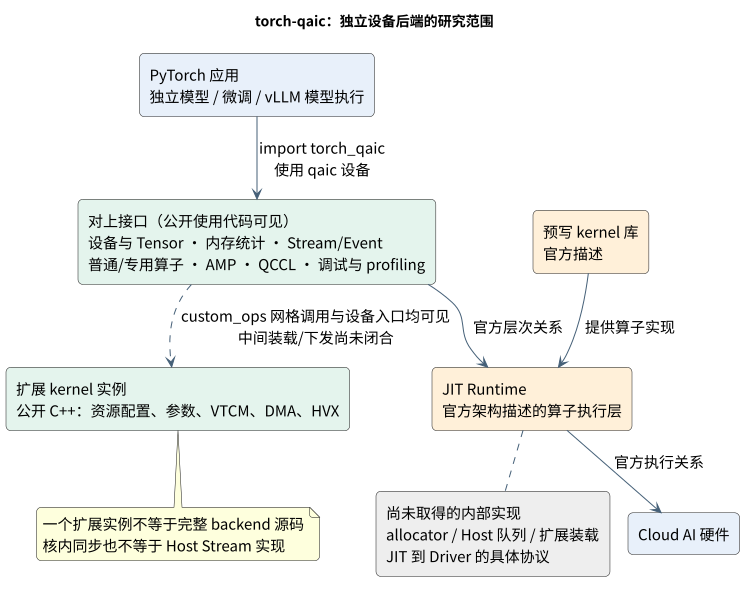
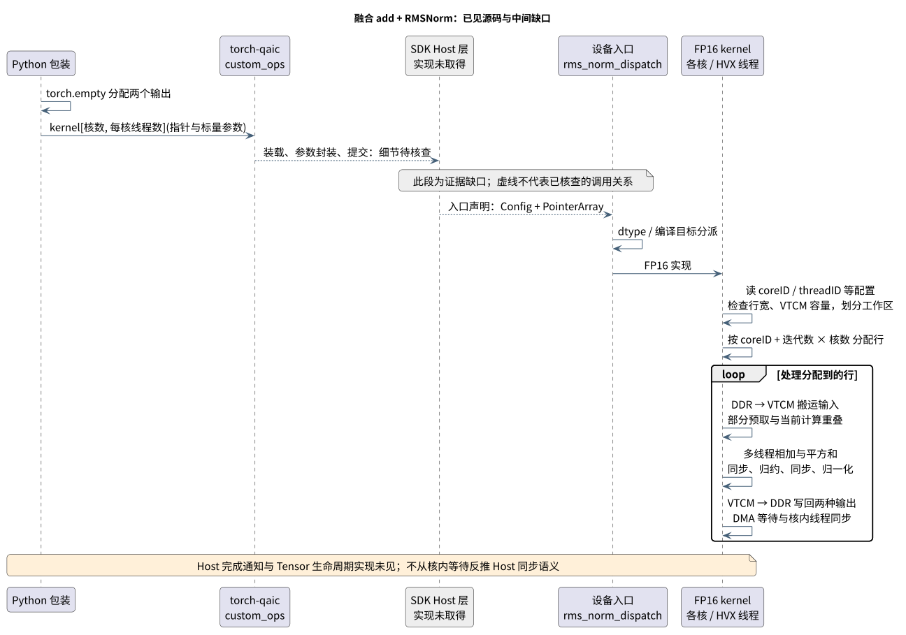

# torch-qaic：高通 PyTorch 设备后端、算子执行与资源接口

> 调研日期：2026-09-23。本文独立研究 PyTorch 的高通 Cloud AI 后端 `torch-qaic`，不要求读者先了解 vLLM。
> 讲解结构参考 [torch_npu](https://terapines.feishu.cn/wiki/Q08QwpXPqixhYWktsM7cDyQznMh)，读取 revision 21；不套用其 allocator、Host 队列或 CANN 实现。
> 证据范围：官方 PyTorch 栈说明、独立模型使用代码、后端扩展接口调用代码、公开设备 kernel。尚未取得 torch-qaic SDK 包及完整 Host 实现；本文明确区分“实现已见”“调用已见”和“官方描述”。

## 1. 什么是 PyTorch 设备后端？

写 `tensor.to('qaic:0')` 时，程序表达的是“把这个张量交给某个设备”。后续算子不仅要算出正确结果，还涉及存储分配、数据搬运、执行顺序、同步与错误处理。**torch-qaic 就是让 PyTorch 使用高通 Cloud AI 设备的后端。**

官方说明确认了三个角色：torch-qaic 注册设备，JIT Runtime 执行算子，预写 kernel 库支持多个 NSP。其架构图标注以单个算子为调度单位。这是该官方 Eager 栈的描述，不是对所有编译/融合路径的概括。[官方 PyTorch Workflow（SDK 1.21）](https://quic.github.io/cloud-ai-sdk-pages/1.21/Getting-Started/PyTorch-Workflow/Eager-Mode-Finetune/index.html)

### 1.1 放在系统中看



| 层 | 给读者的解释 | 本轮证据 |
| --- | --- | --- |
| PyTorch 模型 | 描述网络和张量运算 | QEfficient 微调代码直接运行 PyTorch 模型 |
| torch-qaic | 把模型涉及的设备操作接入高通后端 | 官方设备注册说明；设备、AMP、debug、profile 调用 |
| JIT Runtime | 官方栈中的算子执行层 | 官方架构说明；扩展 kernel 使用 JIT 入口类型 |
| 设备 kernel | 真正处理数据的代码 | 公开 add+RMSNorm 的 Hexagon/HVX 源码 |
| 设备执行资源 | 计算核、设备内存、局部工作区和搬运接口 | kernel 中的 core/thread、DDR 指针、VTCM 与 DMA 操作 |

证据：[官方 PyTorch Workflow（SDK 1.21）](https://quic.github.io/cloud-ai-sdk-pages/1.21/Getting-Started/PyTorch-Workflow/Eager-Mode-Finetune/index.html)；[train_utils.py:186–201](https://github.com/quic/efficient-transformers/blob/e127a6b741d8b71e81134cc76c7e24cea7210cdc/QEfficient/finetune/utils/train_utils.py#L186-L201)；[dispatch.cpp:19–64](https://github.com/qualcomm/vllm-qaic/blob/3212cc670130b7e5290b429f781dc978d7ecf430/csrc/add_rms_norm/dispatch.cpp#L19-L64)；[kernel.cpp:156–220](https://github.com/qualcomm/vllm-qaic/blob/3212cc670130b7e5290b429f781dc978d7ecf430/csrc/add_rms_norm/kernel.cpp#L156-L220)。JIT 内部线程、Host/Driver 交互和固件分发机制未在这些证据中展开。

### 1.2 与几个相近名字的区别

- `vllm-qaic` 是服务框架插件，是 torch-qaic 的使用者之一。
- `QEfficient` 是模型工具与执行工作流集合；其 AoT 导出编译和 PyTorch 微调是不同使用方式。
- AoT 中的 `qaicrt.Program/ExecObj/Queue` 不能未经核查就当成 torch-qaic JIT 的内部对象。

独立于 vLLM 的 QEfficient 微调入口导入 `torch_qaic`，把 batch 搬到目标设备，执行模型前向、反向与优化器步骤。它证明研究范围不能仅限于 vLLM 推理。[finetune.py:38–45](https://github.com/quic/efficient-transformers/blob/e127a6b741d8b71e81134cc76c7e24cea7210cdc/QEfficient/cloud/finetune.py#L38-L45)；[train_utils.py:186–201](https://github.com/quic/efficient-transformers/blob/e127a6b741d8b71e81134cc76c7e24cea7210cdc/QEfficient/finetune/utils/train_utils.py#L186-L201)；[train_utils.py:246–263](https://github.com/quic/efficient-transformers/blob/e127a6b741d8b71e81134cc76c7e24cea7210cdc/QEfficient/finetune/utils/train_utils.py#L246-L263)

## 2. 设备注册、设备选择与 PyTorch 分发

### 2.1 使用端能看到什么？

微调程序调用设备模块的 `device_count()` 和 `set_device()`；DDP 模式下由本地 rank 计算设备索引。vLLM 平台还声明 `dispatch_key='PrivateUse1'`，使用 `qaic` 设备类型。[finetune.py:83–119](https://github.com/quic/efficient-transformers/blob/e127a6b741d8b71e81134cc76c7e24cea7210cdc/QEfficient/cloud/finetune.py#L83-L119)；[platform_base.py:48–71](https://github.com/qualcomm/vllm-qaic/blob/3212cc670130b7e5290b429f781dc978d7ecf430/vllm_qaic/platform_base.py#L48-L71)

PyTorch 本身将 PrivateUse1 作为外部设备接入点，其源码说明了“为 dispatch key 注册 kernel，再为设备命名”的机制。这可以解释框架的扩展位置；**不能据此声称已看到 torch-qaic 内部的注册函数或文件。** [backend_registration.py:76–130](https://github.com/pytorch/pytorch/blob/aa0848b617bde8814291fbe9b025f5c8ce124c3b/torch/utils/backend_registration.py#L76-L130)

### 2.2 两种算子入口不要混淆

| 入口 | 已见实例 | 能确认什么 |
| --- | --- | --- |
| 普通 PyTorch API | `F.rms_norm`、模型前向中的 Tensor 运算 | 应用保留 PyTorch 运算表达 |
| 专用算子/扩展 | `torch.ops.qaic.rotary_embedding`、`torch_qaic.custom_ops.rms_norm_dispatch` | 后端存在可调用的专用算子和 kernel 扩展接口 |

源码：[layernorm.py:20–40](https://github.com/qualcomm/vllm-qaic/blob/3212cc670130b7e5290b429f781dc978d7ecf430/vllm_qaic/ops/layernorm.py#L20-L40)；[rotary_embedding.py:47–77](https://github.com/qualcomm/vllm-qaic/blob/3212cc670130b7e5290b429f781dc978d7ecf430/vllm_qaic/ops/rotary_embedding.py#L47-L77)；[_custom_ops.py:12–50](https://github.com/qualcomm/vllm-qaic/blob/3212cc670130b7e5290b429f781dc978d7ecf430/vllm_qaic/_custom_ops.py#L12-L50)。这两条入口都不意味着所有输入都命中同一设备 kernel；完整 dtype/shape/stride 分发规则需要后端注册与实现表。

## 3. 内存：分清张量存储与 kernel 工作区

### 3.1 张量级内存接口

公开调用代码使用 `torch.empty(..., device=input.device)` 分配输出，并通过 `torch.qaic.empty_cache()`、`reset_peak_memory_stats()`、`mem_get_info()` 等接口管理或观察设备内存。[_custom_ops.py:12–50](https://github.com/qualcomm/vllm-qaic/blob/3212cc670130b7e5290b429f781dc978d7ecf430/vllm_qaic/_custom_ops.py#L12-L50)；[worker.py:342–408](https://github.com/qualcomm/vllm-qaic/blob/3212cc670130b7e5290b429f781dc978d7ecf430/vllm_qaic/worker/worker.py#L342-L408)；[platform_base.py:148–161](https://github.com/qualcomm/vllm-qaic/blob/3212cc670130b7e5290b429f781dc978d7ecf430/vllm_qaic/platform_base.py#L148-L161)

从这些接口可以确认应用能申请设备 Tensor、读取内存统计、请求清理缓存。**不能从 `empty_cache` 这个名字推导出 allocator 的块大小、split/merge、跨流回收或 OOM 重试策略。**

插件的内存适配还绕过了 `torch.accelerator`，改用 platform 的内存接口。其注释指出与通用 DeviceAllocator 假设不兼容；函数体可确认测量路径的替换，但不能替代 torch-qaic allocator 源码。[patch_mem_utils.py:7–41](https://github.com/qualcomm/vllm-qaic/blob/3212cc670130b7e5290b429f781dc978d7ecf430/vllm_qaic/patch/patch_mem_utils.py#L7-L41)

### 3.2 算子内部还会管理另一种空间

公开 RMSNorm kernel 使用传入的 DDR 指针，同时通过 `qshimGetBaseVtcmAddr()` 获取 VTCM 工作区。VTCM 在这个 kernel 中用于暂存输入、权重、输出、归约结果和搬运状态；代码查询容量，按 128 字节对齐划分区域，容量不足则返回错误。[kernel.cpp:156–220](https://github.com/qualcomm/vllm-qaic/blob/3212cc670130b7e5290b429f781dc978d7ecf430/csrc/add_rms_norm/kernel.cpp#L156-L220)

读者可以把 DDR 理解为这里存放输入输出的大空间，把 VTCM 理解为 kernel 使用的局部工作区。**这只是当前 kernel 展现的访问方式，不表示每个 Tensor 都有一份 VTCM 副本，也不表示已经查明设备级内存分配策略。**

| 需要解释的内存问题 | 本轮已看到 | 尚未闭合 |
| --- | --- | --- |
| Tensor 输出从哪里申请 | `torch.empty` 指定设备 | Host allocator 到设备分配的具体实现 |
| kernel 如何取得输入输出 | `AicJitPointerArray` 里的指针 | Host Tensor 到该指针数组的转换过程 |
| kernel 临时数据放哪里 | VTCM 地址与显式区域布局 | Runtime 如何隔离不同 kernel 的工作区 |
| kernel 什么时候可以复用空间 | 本例有 DMA 等待和核内线程同步 | Tensor 生命周期与跨 Stream 回收协议 |

## 4. Stream、Event 与执行顺序

公开使用代码将 `torch.Event`、`torch.cuda.Stream` 临时替换为 `qaic.Event`、`qaic.Stream`，并提供 `qaic.synchronize()` 调用点。这些是后端对上提供执行资源抽象的证据。[model_runner.py:1956–1966](https://github.com/qualcomm/vllm-qaic/blob/3212cc670130b7e5290b429f781dc978d7ecf430/vllm_qaic/worker/model_runner.py#L1956-L1966)；[model_runner.py:326–386](https://github.com/qualcomm/vllm-qaic/blob/3212cc670130b7e5290b429f781dc978d7ecf430/vllm_qaic/worker/model_runner.py#L326-L386)

必须区分两个层次：

- **Host/PyTorch 层**：Stream/Event 表达操作顺序、依赖与同步。当前只见接口使用，未见其内部队列与线程实现。
- **kernel 内部**：RMSNorm 使用 `qaicSyncHVXThread()` 协调核内 HVX 线程，使用 `qshimUDmaWait()` 等待数据搬运。它们不是 PyTorch Event 的实现证明。[kernel.cpp:19–70](https://github.com/qualcomm/vllm-qaic/blob/3212cc670130b7e5290b429f781dc978d7ecf430/csrc/add_rms_norm/kernel.cpp#L19-L70)；[kernel.cpp:73–154](https://github.com/qualcomm/vllm-qaic/blob/3212cc670130b7e5290b429f781dc978d7ecf430/csrc/add_rms_norm/kernel.cpp#L73-L154)

因此目前不能给出“每个 Stream 一条硬件队列”“存在后台消费者线程”“Tensor 析构通过 Event 延迟回收”等确定结论。能确认的 kernel 同步行为，在下一节具体展示。

## 5. 一次融合 add+RMSNorm 如何执行？

选这个例子，是因为同时找到了 **Python 调用端、构建接口、设备入口和计算源码**。代码来自公开 `vllm-qaic/csrc` 与其包装，是 torch-qaic 扩展机制的使用实例，不能当成整个后端的实现。

RMSNorm 的作用是对每一行数据做归一化。这个融合版本先将残差与当前输入相加，再做归一化，返回“相加结果”和“归一化结果”。[layernorm.py:20–40](https://github.com/qualcomm/vllm-qaic/blob/3212cc670130b7e5290b429f781dc978d7ecf430/vllm_qaic/ops/layernorm.py#L20-L40)；[kernel.cpp:73–154](https://github.com/qualcomm/vllm-qaic/blob/3212cc670130b7e5290b429f781dc978d7ecf430/csrc/add_rms_norm/kernel.cpp#L73-L154)



### 5.1 Host 侧：输出缓冲区和执行网格

Python 包装从 `torch_qaic.custom_ops` 取到 `rms_norm_dispatch`，为两个输出创建 Tensor，查询设备核数与每核 HVX 线程数，再用下面的接口形式提交参数：

```python
kernel[num_cores, threads_per_core](inputs..., outputs..., scalar_args...)
```

实际传入输入、权重、输出、epsilon、行宽、元素数和 dtype 标志。这个二维 launch 网格把 **设备选择**与**设备内部核/线程选择**分开表达。[_custom_ops.py:12–50](https://github.com/qualcomm/vllm-qaic/blob/3212cc670130b7e5290b429f781dc978d7ecf430/vllm_qaic/_custom_ops.py#L12-L50)；[platform_base.py:98–136](https://github.com/qualcomm/vllm-qaic/blob/3212cc670130b7e5290b429f781dc978d7ecf430/vllm_qaic/platform_base.py#L98-L136)

这与 `torch.device('qaic:0')` 不是同一个层次：device index 选择设备，launch grid 描述这次 kernel 如何使用内部资源。

### 5.2 kernel 从哪里来？

构建代码使用 `torch_qaic.custom_ops.build_utils.HexagonKernelExtension` 与 `QAicBuildExt`（[构建类入口 setup.py:209–224](https://github.com/qualcomm/vllm-qaic/blob/3212cc670130b7e5290b429f781dc978d7ecf430/setup.py#L209-L224)）。另一个无需导入设备后端的构建分支直接配置 `hexagon-clang++`、JIT include 目录和共享库输出 `vllm_qaic/hexagon_kernels.so`。[setup.py:100–165](https://github.com/qualcomm/vllm-qaic/blob/3212cc670130b7e5290b429f781dc978d7ecf430/setup.py#L100-L165)；[setup.py:43–97](https://github.com/qualcomm/vllm-qaic/blob/3212cc670130b7e5290b429f781dc978d7ecf430/setup.py#L43-L97)

由此可以确认 kernel 可以在扩展构建阶段编译成库。**“JIT Runtime”这个名字不等于每次 PyTorch 调用都临时编译一遍 C++，也不等于 `torch.compile`。** 本轮没有看到这份 `.so` 被装载、导出对象被绑定并下发到设备的 Host 代码，因此图中专门保留了这段缺口。

### 5.3 设备入口：读取参数并选择实现

公开 `rms_norm_dispatch` 接受 `AicJitEntryPointConfig` 与 `AicJitPointerArray`；读取 dtype 标志，按编译目标选择 FP16/BF16 实现或返回不支持错误。设备函数随后读取输入输出指针、行宽、元素数，以及 `coreID / numCores / threadID / numThreads`。[dispatch.cpp:19–64](https://github.com/qualcomm/vllm-qaic/blob/3212cc670130b7e5290b429f781dc978d7ecf430/csrc/add_rms_norm/dispatch.cpp#L19-L64)；[kernel.cpp:156–220](https://github.com/qualcomm/vllm-qaic/blob/3212cc670130b7e5290b429f781dc978d7ecf430/csrc/add_rms_norm/kernel.cpp#L156-L220)

这里可以看到真正的接口形状：**执行资源配置、数据指针、标量参数、状态码**。结构体完整定义在 SDK 头文件中，本地没有取得，不能补写未知字段或 ABI 布局。

注意，当前 dispatcher 注释中的部分参数说明与函数体/包装不一致；本文参数解释以实际读取和传参为准。FP16 主体读取指针数组下标 3 为 residual 输出、下标 4 为 normalized output，与 Python 包装一致。[_custom_ops.py:12–50](https://github.com/qualcomm/vllm-qaic/blob/3212cc670130b7e5290b429f781dc978d7ecf430/vllm_qaic/_custom_ops.py#L12-L50)；[kernel.cpp:156–220](https://github.com/qualcomm/vllm-qaic/blob/3212cc670130b7e5290b429f781dc978d7ecf430/csrc/add_rms_norm/kernel.cpp#L156-L220)

### 5.4 多个 NSP 怎样分工？

本例按行分配工作：第 `coreID` 个核处理 `coreID, coreID + numCores, …` 行；每行内部由多个 HVX 线程按向量块分工。例如 8 行、4 核时，核 0 处理行 0/4，核 1 处理行 1/5，其余类推。这是从行号公式得到的说明性例子，不是设备固定核数。[kernel.cpp:251–376](https://github.com/qualcomm/vllm-qaic/blob/3212cc670130b7e5290b429f781dc978d7ecf430/csrc/add_rms_norm/kernel.cpp#L251-L376)；[kernel.cpp:73–154](https://github.com/qualcomm/vllm-qaic/blob/3212cc670130b7e5290b429f781dc978d7ecf430/csrc/add_rms_norm/kernel.cpp#L73-L154)

### 5.5 数据怎样流动？

1. 检查行宽满足向量宽度约束，检查 VTCM 容量。
2. 将权重搬进 VTCM，并准备输入的双缓冲区域。
3. 核内一个线程提交后续行 DMA；其他线程按分工处理当前行。
4. 各线程计算相加结果与平方和，同步后由一个线程汇总归约值。
5. 再同步，各线程执行归一化和权重乘法。
6. 将两种输出从 VTCM 写回 DDR，等待相关搬运并完成同步。

证据：[kernel.cpp:156–220](https://github.com/qualcomm/vllm-qaic/blob/3212cc670130b7e5290b429f781dc978d7ecf430/csrc/add_rms_norm/kernel.cpp#L156-L220)；[kernel.cpp:251–376](https://github.com/qualcomm/vllm-qaic/blob/3212cc670130b7e5290b429f781dc978d7ecf430/csrc/add_rms_norm/kernel.cpp#L251-L376)；[kernel.cpp:73–154](https://github.com/qualcomm/vllm-qaic/blob/3212cc670130b7e5290b429f781dc978d7ecf430/csrc/add_rms_norm/kernel.cpp#L73-L154)；[kernel.cpp:19–70](https://github.com/qualcomm/vllm-qaic/blob/3212cc670130b7e5290b429f781dc978d7ecf430/csrc/add_rms_norm/kernel.cpp#L19-L70)。

“搬运和计算重叠”在本例中有具体范围：下一行 attn 输入的 DMA 会立即等待，x 输入的预取可保持在途并在计算后等待。不能把双缓冲笼统解释成所有数据传输都充分重叠，也没有实测可以证明其性能收益。[kernel.cpp:251–376](https://github.com/qualcomm/vllm-qaic/blob/3212cc670130b7e5290b429f781dc978d7ecf430/csrc/add_rms_norm/kernel.cpp#L251-L376)

## 6. 算子覆盖、CPU fallback 与数值验证

官方微调文档提供 `QAIC_DEBUG=1`，用于了解 CPU fallback 算子；公开 RoPE 包装的注释描述了不支持 dtype 或非连续输入时的 CPU 分解回退，但该回退函数体不在本轮材料中。前者是官方说明，后者是调用端注释，均不能替代完整算子支持表。[官方 Finetune Infra（v1.21.6）](https://quic.github.io/efficient-transformers/source/release/v1.21.6/source/finetune.html)；[rotary_embedding.py:16–25](https://github.com/qualcomm/vllm-qaic/blob/3212cc670130b7e5290b429f781dc978d7ecf430/vllm_qaic/ops/rotary_embedding.py#L16-L25)

这意味着研究 backend 时至少要分别问：

| 问题 | 需要什么证据 |
| --- | --- |
| 运算能否执行 | 支持的输入与错误行为 |
| 是否在设备上执行 | dispatcher 路径、fallback 日志或 trace |
| 输出是否正确 | dtype、shape、stride 组合下的数值比较 |
| 性能是否符合预期 | 搬运、排队、kernel 执行和同步耗时 |

QEfficient 已提供 `torch_qaic.debug.OpByOpVerifierMode` 使用入口，通过 `DispatchFilterConfig` 设置验证范围，与参考设备结果比较；还暴露容差和 mismatch 时使用参考输出的选项。**启用验证后可能使用参考结果继续执行，所以“验证流程跑完”不等同于“所有设备算子都正确”。** [helper.py:126–175](https://github.com/quic/efficient-transformers/blob/e127a6b741d8b71e81134cc76c7e24cea7210cdc/QEfficient/finetune/utils/helper.py#L126-L175)

## 7. AMP、反向传播、通信与 profiling

这些能力不应因调研从 vLLM 开始而被忽略。

| 子系统 | 已核查的公开使用路径 | 能得出的结论及限制 |
| --- | --- | --- |
| AMP | `torch.autocast(device_type=...)`；`torch.qaic.amp.GradScaler` | 有混合精度使用入口，未取得内部转换/缩放实现 |
| Autograd/训练 | 模型前向、`backward()`、optimizer/scaler step | 有面向 QAIC 的微调工作流，不证明全算子训练覆盖 |
| 集合通信 | `dist.init_process_group('qccl', ...)` | 高通设备选择 QCCL 后端，未核查内部算法与传输协议 |
| Profiling | `torch_qaic.profile.start_profiling/stop_profiling` | 有后端专用采集入口，未分析完整 trace 格式 |

证据：[helper.py:110–123](https://github.com/quic/efficient-transformers/blob/e127a6b741d8b71e81134cc76c7e24cea7210cdc/QEfficient/finetune/utils/helper.py#L110-L123)；[helper.py:178–201](https://github.com/quic/efficient-transformers/blob/e127a6b741d8b71e81134cc76c7e24cea7210cdc/QEfficient/finetune/utils/helper.py#L178-L201)；[train_utils.py:246–263](https://github.com/quic/efficient-transformers/blob/e127a6b741d8b71e81134cc76c7e24cea7210cdc/QEfficient/finetune/utils/train_utils.py#L246-L263)；[finetune.py:83–119](https://github.com/quic/efficient-transformers/blob/e127a6b741d8b71e81134cc76c7e24cea7210cdc/QEfficient/cloud/finetune.py#L83-L119)；[helper.py:206–233](https://github.com/quic/efficient-transformers/blob/e127a6b741d8b71e81134cc76c7e24cea7210cdc/QEfficient/finetune/utils/helper.py#L206-L233)。

同一个模型的训练、Eager 推理、vLLM 调度与 AoT 程序执行是不同层次的能力。不能把其中一个应用的限制推广成整个 torch-qaic backend 的限制。

## 8. 编译与 Runtime 边界

| 名称 | 已知用途 | 当前不能替代它的其他概念 |
| --- | --- | --- |
| Hexagon kernel 扩展构建 | C++ kernel 编译为目标库 | 不是整个模型的 AoT 图编译 |
| torch-qaic JIT Runtime | 官方描述的算子执行层 | 不等于 PyTorch Dynamo/Inductor |
| `torch.compile` backend | PyTorch 图捕获与编译接入 | 本轮没有确认 torch-qaic 完整接入实现 |
| AoT QPC Runtime | 执行已编译模型程序 | 不能直接作为 JIT Runtime 的源码替身 |

当前 vLLM 插件关闭自己的 compilation mode，仅能证明该应用配置下的行为；不能据此判定独立 torch-qaic 包在其他应用中是否支持某种编译模式。[platform_base.py:387–409](https://github.com/qualcomm/vllm-qaic/blob/3212cc670130b7e5290b429f781dc978d7ecf430/vllm_qaic/platform_base.py#L387-L409)

### 8.1 现在可列出的真实接口

| 方向 | 已见 API/类型 | 说明 |
| --- | --- | --- |
| 应用 → 设备模块 | `device_count / set_device / mem_get_info / synchronize` | 设备选择、内存观察、同步 |
| 扩展 → 构建工具 | `HexagonKernelExtension / QAicBuildExt` | kernel 扩展的构建入口 |
| Python → kernel 包装 | `torch_qaic.custom_ops.<symbol>[cores, threads]` 参数调用 | kernel 参数与执行网格 |
| Runtime → 设备入口（入口声明可见） | `AicJitEntryPointConfig / AicJitPointerArray` | 资源配置与参数容器；Host 组装过程未见 |
| kernel → 设备支持层 | `qshimQuery / qshimGetBaseVtcmAddr` | 查询并使用 VTCM |
| kernel → 搬运/同步支持层 | `qshimLinearUdmaSubmit / qshimUDmaWait / qaicSyncHVXThread` | 提交搬运、等待和核内线程同步 |

对应实现与使用证据：[finetune.py:83–119](https://github.com/quic/efficient-transformers/blob/e127a6b741d8b71e81134cc76c7e24cea7210cdc/QEfficient/cloud/finetune.py#L83-L119)；[platform_base.py:148–161](https://github.com/qualcomm/vllm-qaic/blob/3212cc670130b7e5290b429f781dc978d7ecf430/vllm_qaic/platform_base.py#L148-L161)；[model_runner.py:326–386](https://github.com/qualcomm/vllm-qaic/blob/3212cc670130b7e5290b429f781dc978d7ecf430/vllm_qaic/worker/model_runner.py#L326-L386)；[setup.py:100–165](https://github.com/qualcomm/vllm-qaic/blob/3212cc670130b7e5290b429f781dc978d7ecf430/setup.py#L100-L165)；[_custom_ops.py:12–50](https://github.com/qualcomm/vllm-qaic/blob/3212cc670130b7e5290b429f781dc978d7ecf430/vllm_qaic/_custom_ops.py#L12-L50)；[kernel.cpp:156–220](https://github.com/qualcomm/vllm-qaic/blob/3212cc670130b7e5290b429f781dc978d7ecf430/csrc/add_rms_norm/kernel.cpp#L156-L220)；[kernel.cpp:19–70](https://github.com/qualcomm/vllm-qaic/blob/3212cc670130b7e5290b429f781dc978d7ecf430/csrc/add_rms_norm/kernel.cpp#L19-L70)。

这里没有补写“JIT → Driver”的 API 名称，因为本轮尚未拿到该桥接实现。公开 AoT Runtime 中存在 ioctl 路径，并不能证明当前 JIT 使用相同对象与协议。

## 9. 源码可见范围与下一步取证

torch-qaic 的已知分发入口是 Apps SDK：安装文档要求使用 `--install-torch-qaic`，随后安装 `integrations/torch_qaic/py312/` 下的 wheel。官方 SDK 下载流程通过登录 Qualcomm Package Manager 获取包。[pyt_mode.md:30–64](https://github.com/qualcomm/vllm-qaic/blob/3212cc670130b7e5290b429f781dc978d7ecf430/docs/docs/getting_started/installation/pyt_mode.md#L30-L64)；[官方 SDK 下载说明](https://quic.github.io/cloud-ai-sdk-pages/latest/Getting-Started/Installation/download-sdks.html)

当前环境没有 `/opt/qti-aic`；GitHub 仓库名搜索未找到独立 torch-qaic 仓库。这两件事不证明它一定闭源，也不证明 SDK wheel 中一定包含完整源码。当前缺口是**尚未取得匹配版本的包内容**。

| 尚缺的实现 | 应首先定位的材料 | 要回答的具体问题 |
| --- | --- | --- |
| 设备注册与算子分发表 | 包的 Python 初始化、native 扩展和注册源码 | 普通 ATen、专用 op、fallback 分别注册在哪里？ |
| allocator 与 copy | 存储分配/释放、copy kernel 实现 | Host/设备指针怎样关联？跨流何时安全复用？ |
| Stream/Event | Host wrapper 与 Runtime 实现 | 排队、依赖、同步、异常分别如何实现？ |
| kernel loader/JIT | 扩展库装载器、JIT API 与头文件 | `.so` 如何装载，参数如何封装，下发如何完成？ |
| QCCL | ProcessGroup 与通信库 | 通信完成如何与计算流衔接？ |
| Driver/Firmware 接口 | JIT 对应 SDK 库与协议 | 哪些资源由 Host 管，哪些由设备管理？ |

## 10. 对新设备后端的研究启示

以下是研究归纳：

- 设备 ID、kernel 的核/线程网格、张量 placement 应分别取证。本例能看到前两者，不能据此推导多份 Local DRAM 的离散布局。
- Tensor allocator 与 kernel 局部工作区是两个层次；动态分配和 AoT 预规划不能只用一个“支持内存管理”概括。
- 扩展算子需明确输入约束、输出存储、资源配置和错误返回；这些可从一个具体 kernel 逐项验证。
- 最小正确性闭环不仅是返回数值，还应包含跨流依赖、缓冲区生命周期与 fallback 可观测性。

本文已把独立 backend 的功能面、接口与一个公开 kernel 实例展开；Host 内部 allocator/队列/JIT 到 Driver 的链路仍未闭合，不将本篇称为完整内部实现分析。服务端接入另见 [vLLM-QAIC 专题](../aot/28-vllm-qaic-backend.md)。

## 源码版本与复核入口

- `qualcomm/efficient-transformers/`：`e127a6b741d8b71e81134cc76c7e24cea7210cdc`。实际路径：`/home/yyl/workspace/llmss/engine/vllm/qualcomm/efficient-transformers`。
- `vllm-qaic/`：`3212cc670130b7e5290b429f781dc978d7ecf430`。实际路径：`/home/yyl/workspace/llmss/engine/vllm/vllm-qaic`。
- `pytorch/`：`aa0848b617bde8814291fbe9b025f5c8ce124c3b`。实际路径：`/home/yyl/workspace/llmss/engine/vllm/pytorch`。

正文链接均固定 commit 与行号；引用其他仓库的使用代码时，只证明接口如何被调用，不自动证明后端内部实现。官方网页核查时间：2026-09-22 至 2026-09-23。本轮未执行加速卡测试。
